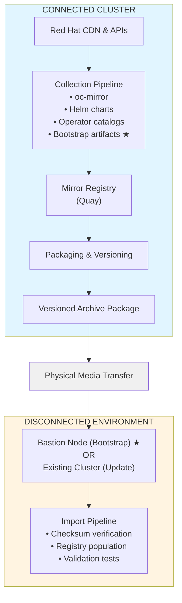

# Disconnected OpenShift Mirror Pipeline

A comprehensive, automated pipeline solution for mirroring OpenShift artifacts to air-gapped (disconnected) environments using OpenShift Pipelines (Tekton).

## Overview

This project enables fully automated artifact synchronization from internet-connected OpenShift clusters to air-gapped clusters via physical media transport. It handles container images, Helm charts, operator bundles, and generic artifacts with complete version tracking and validation.

**New: Bootstrap Installation Support** - Archives now include everything needed to install a fresh OpenShift cluster in a disconnected environment, including the installer binary, mirror-registry tool, and detailed installation guides.

### Key Features

- **Fully Automated**: Scheduled and event-driven pipeline execution
- **Comprehensive Artifact Support**: Container images, Helm charts, OLM operators, binaries
- **Version Tracking**: Immutable versioning with complete manifest tracking
- **Red Hat Release Monitoring**: Automatic detection and mirroring of new releases
- **Secure Transport**: Physical media with checksum verification at every stage
- **Incremental Updates**: Support for both full and delta synchronization
- **Bootstrap Installation**: Complete toolkit for fresh OpenShift installations
- **Production Ready**: RBAC, audit logging, rollback capability

## Use Cases

### 1. Updating Existing Disconnected Clusters
Mirror new images and operators to keep disconnected clusters up-to-date with security patches and new features.

### 2. Fresh OpenShift Installation (Bootstrap)
Install a brand new OpenShift cluster in a disconnected environment starting from bare metal or virtual machines.

**See:** [Bootstrap Installation Guide](docs/bootstrap-installation.md)

## Architecture



**★ New: Bootstrap installation support**

## Quick Start

### Prerequisites

**Connected Cluster:**
- OpenShift 4.12+ (4.15+ recommended)
- Cluster-admin access
- 500GB+ storage
- Internet connectivity
- Red Hat pull secret configured

**Disconnected Cluster OR Bastion Node:**
- OpenShift 4.12+ (for existing cluster updates)
- RHEL 8/9 bastion node (for fresh installations)
- Cluster-admin access (if cluster exists)
- 300GB+ storage
- No internet connectivity

**Required Tools:**
- `oc` CLI (matching cluster version)
- `oc-mirror` v1.0+
- `helm` v3.0+

### Installation

#### 1. Install Operators (Connected Cluster)

```bash
# Install OpenShift Pipelines Operator
oc apply -f manifests/operators/openshift-pipelines/subscription.yaml

# Install Quay Operator (or use existing Quay deployment)
oc apply -f manifests/operators/quay-operator/subscription.yaml

# Wait for operators to be ready
oc wait --for=condition=AtLatestKnown subscription/openshift-pipelines-operator -n openshift-operators --timeout=300s
```

#### 2. Configure Storage and RBAC

```bash
# Create namespace for pipeline operations
oc new-project mirror-pipeline

# Create storage for mirror workspace
oc apply -f manifests/storage/pvc-mirror-storage.yaml -n mirror-pipeline
oc apply -f manifests/storage/pvc-package-storage.yaml -n mirror-pipeline

# Set up RBAC
oc apply -f manifests/rbac/ -n mirror-pipeline
```

#### 3. Configure Mirror Settings

```bash
# Update imageset-config.yaml with your requirements
vi config/connected/imageset-config.yaml

# Update registry URLs in the configuration
# Replace <REGISTRY_URL> with your Quay/mirror registry URL
```

#### 4. Deploy Collection Pipeline

```bash
# Deploy Tekton tasks
oc apply -f pipelines/connected/tasks/ -n mirror-pipeline

# Deploy main pipeline
oc apply -f pipelines/connected/base/pipeline.yaml -n mirror-pipeline
```

#### 5. Run Your First Collection

```bash
# Trigger manual collection
oc create -f pipelines/connected/base/pipelineruns/manual-run.yaml -n mirror-pipeline

# Monitor pipeline execution
oc get pipelinerun -n mirror-pipeline -w

# Check generated archive
oc exec -n mirror-pipeline <pod-name> -- ls -lh /workspace/packages/
```

## Version Format

Each artifact collection is versioned using the format:
```
v{YYYY.MM.DD}.{BUILD_NUMBER}-{TRIGGER_TYPE}
```

Examples:
- `v2026.05.06.001-scheduled` - First scheduled run on May 6, 2026
- `v2026.05.06.002-manual` - Second run (manual trigger)
- `v2026.05.06.003-event` - Third run (event-driven trigger)

## Archive Structure

Each generated archive contains:

```
mirror-v2026.05.06.001/
├── MANIFEST.yaml              # Complete artifact manifest
├── VERSION                    # Version identifier
├── CHECKSUMS.sha256           # SHA256 checksums for all files
├── README.txt                 # Import instructions
├── images/                    # oc-mirror workspace with container images
├── helm-charts/               # Helm chart packages
├── operators/                 # Operator catalog and bundle images
├── artifacts/                 # Binaries and tools ★
│   ├── binaries/
│   │   ├── openshift-install-*.tar.gz  ★ New
│   │   ├── openshift-client-*.tar.gz   ★ New
│   │   ├── oc-mirror.tar.gz            ★ New
│   │   ├── mirror-registry.tar.gz      ★ New
│   │   └── helm-*.tar.gz               ★ New
│   └── docs/
│       └── bootstrap-installation.md    ★ New
└── import-scripts/            # Automated import helper scripts
    └── bootstrap-import.sh     ★ New

★ New: Bootstrap installation artifacts
```

## Usage Scenarios

### Scenario 1: Update Existing Disconnected Cluster

Standard workflow for ongoing updates to a running disconnected cluster.

**See:** README sections above for standard installation and update procedures.

### Scenario 2: Fresh OpenShift Installation (Bootstrap)

Install a brand new OpenShift cluster in a disconnected environment.

**Complete Guide:** [Bootstrap Installation Guide](docs/bootstrap-installation.md)

**Quick Summary:**
```bash
# On connected cluster: Generate mirror archive (standard process)

# Transfer archive to disconnected environment via physical media

# On bastion node in disconnected environment:
# 1. Install mirror-registry
cd /opt/mirror-v2026.05.06.001/artifacts/binaries
tar -xzf mirror-registry.tar.gz
./mirror-registry install --quayHostname $(hostname -f)

# 2. Import mirrored content
cd /opt
./mirror-v2026.05.06.001/import-scripts/bootstrap-import.sh \
  /mnt/usb/mirror-v2026.05.06.001.tar.gz

# 3. Extract installer
cd /opt/mirror-v2026.05.06.001/artifacts/binaries
tar -xzf openshift-install-linux-*.tar.gz
sudo mv openshift-install /usr/local/bin/

# 4. Create install-config.yaml pointing to bastion registry
# See bootstrap-installation.md for complete template

# 5. Install cluster
openshift-install create cluster --dir=/opt/openshift-install
```

## Transferring to Disconnected Environment

### 1. Export Archive from Connected Cluster

```bash
# Copy archive from PVC to local system
oc cp mirror-pipeline/<pod-name>:/workspace/packages/mirror-v2026.05.06.001.tar.gz ./mirror-v2026.05.06.001.tar.gz

# Verify checksums before transfer
tar -xzf mirror-v2026.05.06.001.tar.gz mirror-v2026.05.06.001/CHECKSUMS.sha256
cd mirror-v2026.05.06.001
sha256sum -c CHECKSUMS.sha256
```

### 2. Physical Media Transfer

- Copy archive to encrypted USB drive or approved physical media
- Follow your organization's security procedures for media transport
- Maintain chain of custody documentation

### 3. Import to Disconnected Cluster or Bastion

**For existing cluster updates:**
```bash
# See standard import procedures in README
```

**For fresh installations (bootstrap):**
```bash
# Use bootstrap-import.sh script
./bootstrap-import.sh /path/to/archive.tar.gz
```

## Configuration

### Customizing Image Collections

Edit `config/connected/imageset-config.yaml` to specify:
- OpenShift versions and channels
- Operator catalogs and packages
- Additional container images
- Platform components

### Bootstrap Configuration

Edit `config/connected/bootstrap-config.yaml` to customize:
- OpenShift version for installer binary
- Tools to include in archive
- Installation templates

### Adding Helm Repositories

Edit `config/connected/helm-repos.yaml`:

```yaml
repositories:
  - name: bitnami
    url: https://charts.bitnami.com/bitnami
    charts:
      - nginx
      - postgresql
  - name: myrepo
    url: https://charts.example.com
    charts:
      - myapp
```

## Automation Features

### Scheduled Syncs

Automatic weekly/monthly collections based on configured schedules (Phase 3).

### Event-Driven Triggers

Automatic pipeline execution when new Red Hat releases are detected (Phase 3):
- OpenShift platform updates
- Operator catalog updates
- Security errata (RHSA)

### Incremental Updates

Delta-based mirroring reduces transfer size by 60%+ (Phase 4):
- Only new/changed artifacts
- Tracks base version dependency
- Self-contained fallback to full mirror

## Monitoring and Operations

### Check Pipeline Status

```bash
# List recent pipeline runs
oc get pipelinerun -n mirror-pipeline --sort-by=.metadata.creationTimestamp

# View pipeline logs
tkn pipelinerun logs <pipelinerun-name> -n mirror-pipeline -f

# Check storage utilization
oc get pvc -n mirror-pipeline
```

### Version History

```bash
# List available archives
oc exec -n mirror-pipeline <pod-name> -- ls -lh /workspace/packages/

# View manifest for specific version
oc exec -n mirror-pipeline <pod-name> -- cat /workspace/packages/mirror-v2026.05.06.001/MANIFEST.yaml
```

### Troubleshooting

See [docs/troubleshooting.md](docs/troubleshooting.md) for common issues and solutions.

## Security Considerations

### RBAC

All pipeline operations use least-privilege service accounts. Review and customize RBAC manifests in `manifests/rbac/`.

### Secrets Management

Required secrets:
- Registry pull secrets (Red Hat, Quay)
- Registry push secrets (mirror registries)
- API tokens (for Red Hat release monitoring)

Create secrets in the `mirror-pipeline` namespace:

```bash
# Red Hat pull secret
oc create secret generic redhat-pull-secret \
  --from-file=.dockerconfigjson=/path/to/pull-secret.json \
  --type=kubernetes.io/dockerconfigjson \
  -n mirror-pipeline

# Mirror registry credentials
oc create secret generic mirror-registry-creds \
  --from-file=.dockerconfigjson=/path/to/mirror-creds.json \
  --type=kubernetes.io/dockerconfigjson \
  -n mirror-pipeline
```

### Archive Encryption (Optional)

For additional security during transport:

```bash
# Encrypt archive with GPG
gpg --symmetric --cipher-algo AES256 mirror-v2026.05.06.001.tar.gz

# Decrypt on disconnected side
gpg --decrypt mirror-v2026.05.06.001.tar.gz.gpg > mirror-v2026.05.06.001.tar.gz
```

## Project Structure

```
.
├── config/                    # Configuration files
├── pipelines/                 # Tekton pipeline definitions
├── scripts/                   # Helper scripts
├── manifests/                 # Kubernetes manifests
├── templates/                 # Manifest templates
├── tests/                     # Test suite
├── docs/                      # Documentation
│   ├── architecture.md        # Detailed architecture
│   └── bootstrap-installation.md  # Bootstrap install guide ★ New
└── kustomization/             # Kustomize overlays
```

## Implementation Phases

- **Phase 1 (Weeks 1-2)**: Foundation - Basic collection pipeline ✅ **COMPLETE**
- **Phase 2 (Weeks 3-4)**: Comprehensive artifacts - Helm, operators, import pipeline
- **Phase 3 (Weeks 5-6)**: Automation - Scheduling, event triggers, monitoring
- **Phase 4 (Weeks 7-8)**: Optimization - Incremental updates, testing, hardening

Current status: **Phase 1 - Complete with Bootstrap Support**

## Documentation

- [Architecture](docs/architecture.md) - Detailed architecture and design decisions
- [Bootstrap Installation](docs/bootstrap-installation.md) - Fresh OpenShift install guide ★ **NEW**
- [Operations Guide](docs/operations-guide.md) - Day-2 operations (to be created)
- [Troubleshooting](docs/troubleshooting.md) - Common issues (to be created)

## Contributing

This is a reference architecture. Customize for your environment:
- Adjust ImageSetConfiguration for your required images
- Modify storage sizes based on your needs
- Configure schedules for your update cadence
- Add custom artifact collection tasks

## License

[Your License Here]

## Support

For issues and questions:
- Check [docs/troubleshooting.md](docs/troubleshooting.md)
- Check [docs/bootstrap-installation.md](docs/bootstrap-installation.md) for fresh installs
- Review pipeline logs: `tkn pipelinerun logs <name> -f`
- Examine task results: `oc describe pipelinerun <name>`

## References

- [OpenShift Documentation - Disconnected Installation](https://docs.openshift.com/container-platform/latest/installing/disconnected_install/)
- [oc-mirror Documentation](https://docs.openshift.com/container-platform/latest/installing/disconnected_install/installing-mirroring-installation-images.html)
- [OpenShift Pipelines (Tekton)](https://docs.openshift.com/container-platform/latest/cicd/pipelines/understanding-openshift-pipelines.html)
- [Red Hat Quay](https://docs.redhat.com/en/documentation/red_hat_quay)
- [mirror-registry Tool](https://docs.redhat.com/en/documentation/openshift_container_platform/4.15/html/installing/disconnected-installation-mirroring#installing-mirroring-creating-registry)
