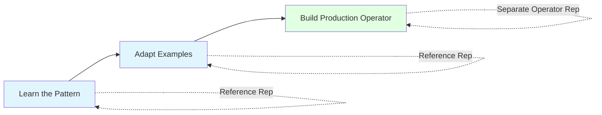
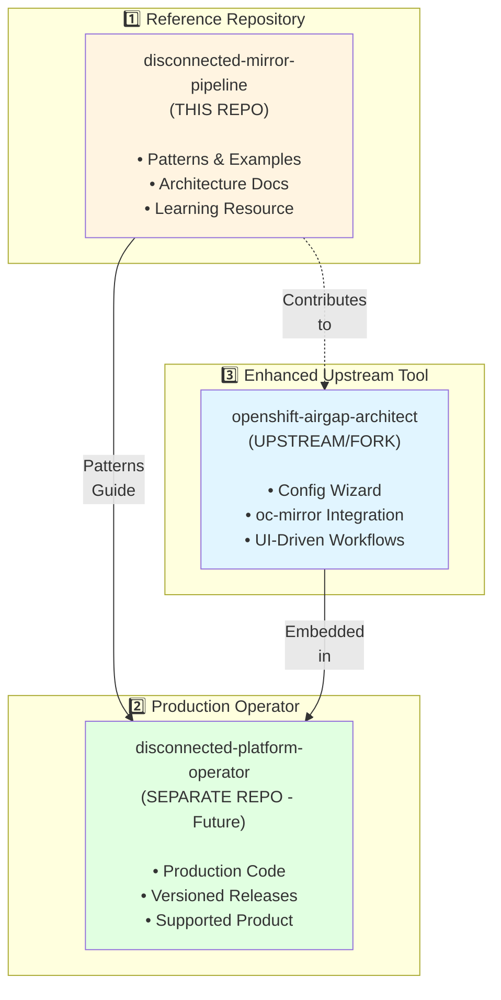
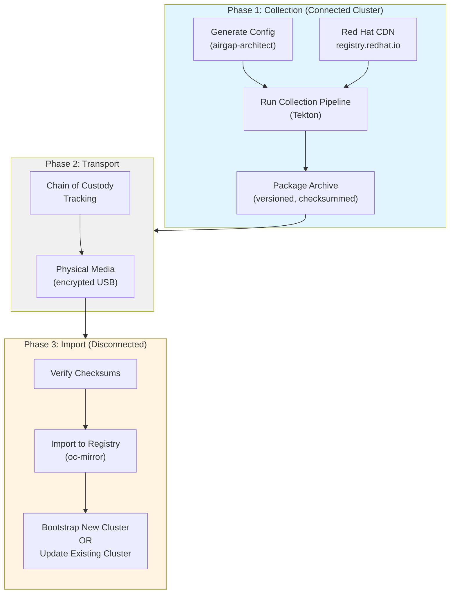
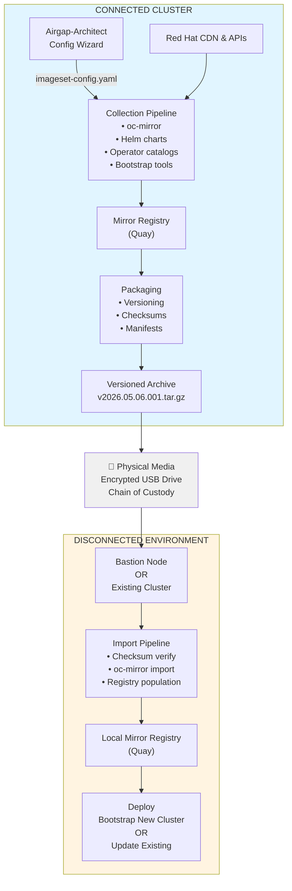
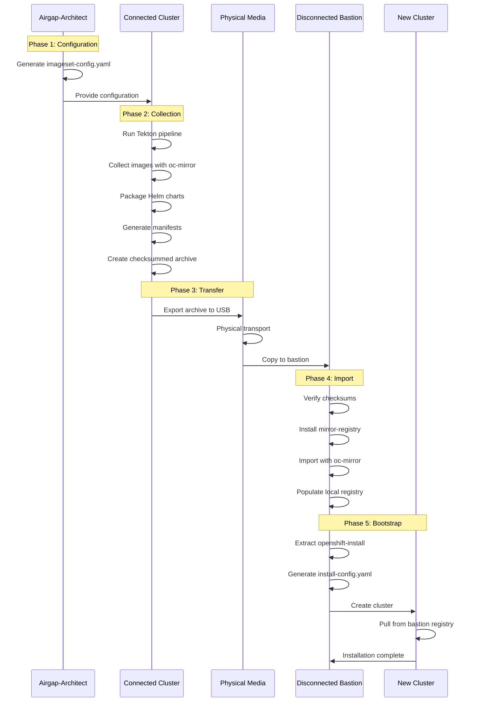

# Disconnected OpenShift Mirror Pipeline

> **THE reference architecture for implementing airgapped release cycles in OpenShift and Kubernetes ecosystems.**

---

## 🎯 What Problem Does This Solve?

You need to keep OpenShift clusters updated in **air-gapped (disconnected) environments** that have **no internet access**.

**The Challenge:**
- Connected clusters can pull images directly from Red Hat registries
- Disconnected clusters cannot access the internet
- You must physically transport artifacts via USB drives or approved media
- Manual processes are error-prone, time-consuming, and don't scale

**The Solution:**
An automated pipeline that:
1. **Collects** artifacts (images, operators, Helm charts) on a connected cluster
2. **Packages** them into versioned, checksummed archives
3. **Transports** via physical media with chain-of-custody
4. **Imports** to disconnected clusters or bastion nodes
5. **Validates** integrity and tracks versions

---

## 📚 What Is This Repository?

### This is a **REFERENCE ARCHITECTURE**, not production code

Think of this as a **blueprint and example implementation** that shows you:
- ✅ **How** airgapped release cycles work (patterns and architecture)
- ✅ **What** components you need (Tekton pipelines, scripts, configurations)
- ✅ **Why** design decisions were made (documented rationale)
- ✅ **Example** implementations you can adapt to your environment

### This is NOT:

- ❌ **A production operator** to install and run
- ❌ **A supported product** with SLAs
- ❌ **A one-size-fits-all solution** that works everywhere without modification

### How to Use This Repository



1. **Learn** from this reference architecture
2. **Adapt** the patterns and examples to your needs
3. **Build** your production implementation in a **separate repository**

---

## 🏗️ The Three-Repository Pattern

This reference architecture establishes the **industry standard pattern** that ALL airgapped implementations should follow:



### Why Three Repositories?

**Different purposes require different approaches:**

| Aspect | Reference Repo | Production Operator | Upstream Tool |
|--------|---------------|---------------------|---------------|
| **Purpose** | Learn & adapt | Deploy & operate | Generate configs |
| **Versioning** | Git tags (optional) | Semantic (v1.0.0) | Upstream versions |
| **Updates** | Continuous | Formal releases | Upstream cadence |
| **Support** | Community | Commercial available | Community/Vendor |
| **Testing** | Examples work | Production suites | Upstream standards |

**📖 Deep Dive:** [Why Separate Repositories](docs/repository-strategy.md) - Complete explanation with analogies

---

## 🗺️ The Complete Architecture

### High-Level Flow



### Detailed Architecture



---

## 🚦 Start Here: Choose Your Path

### Path A: "I want to LEARN about airgapped architectures"

**Goal:** Understand how airgapped release cycles work

**Steps:**
1. Read: [Reference Architecture Pattern](docs/reference-architecture-pattern.md) ⭐ START HERE
2. Read: [Architecture Overview](#detailed-architecture-this-readme)
3. Read: [Bootstrap Workflow](docs/bootstrap-workflow.md) - How to install fresh clusters
4. Explore: Example Tekton pipelines in `pipelines/`
5. Review: Example scripts in `scripts/`

**Time:** 2-4 hours  
**Outcome:** Deep understanding of the architecture

---

### Path B: "I want to USE these patterns in my environment"

**Goal:** Deploy the reference implementation and adapt it

**Steps:**
1. **Understand the architecture** (Path A above)
2. **Set up connected cluster** - Follow [Quick Start](#quick-start) below
3. **Generate configuration** - Use [airgap-architect](https://github.com/bstrauss84/openshift-airgap-architect/)
4. **Run collection** - Execute Tekton pipeline
5. **Transfer artifacts** - Physical media to disconnected environment
6. **Import** - Use bootstrap-import.sh script

**Time:** 1-2 days  
**Outcome:** Working airgapped release cycle

**📖 Detailed Guide:** [Implementation Checklist](docs/reference-architecture-pattern.md#implementation-checklist)

---

### Path C: "I want to BUILD a production operator"

**Goal:** Create a supported, production-grade operator in a separate repository

**Steps:**
1. **Learn the patterns** (Path A above)
2. **Review operator specifications** → [Operator Specs](docs/operator-specs/README.md)
3. **Read repository strategy** → [Why Separate Repos](docs/repository-strategy.md)
4. **Create operator repository** - New repo: `<yourorg>/disconnected-platform-operator`
5. **Implement CRDs** - Using [API Specifications](docs/operator-specs/api-specifications.md)
6. **Build controllers** - Following reference pipeline patterns
7. **Integrate airgap-architect** - Using [Contribution Guide](docs/airgap-architect-contributions.md)
8. **Package as OLM operator** - For OperatorHub distribution

**Time:** 8-12 weeks  
**Outcome:** Production operator ready for v1.0.0 release

**📖 Complete Guide:** [Future Vision: Operator Integration](docs/future-vision-operator-integration.md)

---

### Path D: "I need to BOOTSTRAP a fresh cluster in airgap"

**Goal:** Install a brand new OpenShift cluster with no existing infrastructure

**You need:** A bastion node (RHEL 8/9) and physical media with artifacts

**Steps:**
1. **Obtain archive** - From connected cluster collection
2. **Transfer to bastion** - Via physical media
3. **Install mirror-registry** - Quay on bastion node
4. **Import artifacts** - Use `bootstrap-import.sh`
5. **Generate install-config** - Pointing to bastion registry
6. **Install cluster** - Run openshift-install

**Time:** 4-8 hours  
**Outcome:** Fresh OpenShift cluster running in airgap

**📖 Complete Guide:** [Bootstrap Workflow](docs/bootstrap-workflow.md)

---

## 📖 Documentation Navigation

### 🎯 Core Documents (Read These First)

1. **[Reference Architecture Pattern](docs/reference-architecture-pattern.md)** ⭐ **THE canonical pattern**
   - Industry standard for all airgapped implementations
   - Three-repository pattern explained
   - Complete implementation checklist
   
2. **[Repository Strategy](docs/repository-strategy.md)**
   - Why separate reference, operator, and upstream repos
   - Lifecycle management
   - Team organization
   
3. **[Documentation Index](docs/INDEX.md)**
   - Navigate all docs by role or phase
   - Quick links and status tracking

### 🏗️ For Builders

4. **[Operator Specifications](docs/operator-specs/README.md)**
   - Complete CRD schemas
   - Controller designs
   - Ready for implementation
   
5. **[API Specifications](docs/operator-specs/api-specifications.md)**
   - Full Go type definitions
   - DisconnectedPlatform, ClusterBootstrap, CollectionPipeline CRDs
   
6. **[Future Vision](docs/future-vision-operator-integration.md)**
   - Complete operator architecture
   - Connected vs. airgapped modes
   - Implementation phases

### 🔧 For Operators

7. **[Bootstrap Workflow](docs/bootstrap-workflow.md)**
   - Fresh cluster installation guide
   - Bastion node setup
   - Step-by-step procedures
   
8. **[Configuration Examples](docs/examples/README.md)**
   - How to use airgap-architect
   - Example ImageSetConfigurations
   - Platform-specific configs

### 🤝 For Contributors

9. **[Airgap-Architect Contributions](docs/airgap-architect-contributions.md)**
   - Upstream enhancement proposals
   - Technical designs
   - Contribution process
   
10. **[Overlap Analysis](docs/airgap-architect-overlap-analysis.md)**
    - Integration with airgap-architect
    - What to use when

---

## 🚀 Quick Start: Deploy Reference Implementation

This section shows how to deploy the **reference implementation** (Path B above).

### Prerequisites

**Connected Cluster:**
- OpenShift 4.12+ (4.15+ recommended)
- Cluster-admin access
- 500GB+ storage available
- Internet connectivity
- Red Hat pull secret configured

**Disconnected Environment:**
- RHEL 8/9 bastion node OR existing OpenShift cluster
- 300GB+ storage available
- No internet connectivity

**Tools:**
- `oc` CLI (matching cluster version)
- `oc-mirror` v2.0+
- `helm` v3.0+

### Step 1: Generate Configuration

**Use [OpenShift Airgap Architect](https://github.com/bstrauss84/openshift-airgap-architect/) to generate valid configurations.**

```bash
# Run airgap-architect locally
git clone https://github.com/bstrauss84/openshift-airgap-architect.git
cd openshift-airgap-architect
docker-compose up -d
open http://localhost:3000

# Or deploy in OpenShift
oc new-project airgap-architect
# See docs/examples/README.md for deployment

# Use the wizard to:
# 1. Select platform (vSphere, Bare Metal, AWS GovCloud, etc.)
# 2. Choose OpenShift versions to mirror
# 3. Select operators (Pipelines, Quay, ODF, etc.)
# 4. Add additional images
# 5. Download generated imageset-config.yaml

# Save configuration
cp ~/Downloads/imageset-config.yaml config/connected/imageset-config.yaml
```

**📖 Detailed Instructions:** [Configuration Generation Guide](docs/examples/README.md)

### Step 2: Deploy Pipeline Infrastructure

```bash
# Create namespace
oc new-project mirror-pipeline

# Install operators
oc apply -f manifests/operators/openshift-pipelines/subscription.yaml
oc apply -f manifests/operators/quay-operator/subscription.yaml

# Wait for operators
oc wait --for=condition=AtLatestKnown subscription/openshift-pipelines-operator \
  -n openshift-operators --timeout=300s

# Create storage
oc apply -f manifests/storage/ -n mirror-pipeline

# Set up RBAC
oc apply -f manifests/rbac/ -n mirror-pipeline

# Deploy pipeline tasks
oc apply -f pipelines/connected/tasks/ -n mirror-pipeline

# Deploy main pipeline
oc apply -f pipelines/connected/base/pipeline.yaml -n mirror-pipeline
```

### Step 3: Configure Secrets

```bash
# Red Hat pull secret (from cloud.redhat.com)
oc create secret generic redhat-pull-secret \
  --from-file=.dockerconfigjson=/path/to/pull-secret.json \
  --type=kubernetes.io/dockerconfigjson \
  -n mirror-pipeline

# Mirror registry credentials (your Quay instance)
oc create secret generic mirror-registry-creds \
  --from-file=.dockerconfigjson=/path/to/mirror-creds.json \
  --type=kubernetes.io/dockerconfigjson \
  -n mirror-pipeline
```

### Step 4: Run Your First Collection

```bash
# Trigger manual collection
oc create -f pipelines/connected/base/pipelineruns/manual-run.yaml \
  -n mirror-pipeline

# Monitor execution
oc get pipelinerun -n mirror-pipeline -w

# Check logs
tkn pipelinerun logs -n mirror-pipeline -f

# View results
oc get pipelinerun -n mirror-pipeline
```

### Step 5: Export and Transfer Archive

```bash
# Find the completed archive
oc exec -n mirror-pipeline <pod-name> -- ls -lh /workspace/packages/

# Copy to local system
oc cp mirror-pipeline/<pod-name>:/workspace/packages/mirror-v2026.05.06.001.tar.gz \
  ./mirror-v2026.05.06.001.tar.gz

# Verify checksums
tar -xzf mirror-v2026.05.06.001.tar.gz mirror-v2026.05.06.001/CHECKSUMS.sha256
cd mirror-v2026.05.06.001
sha256sum -c CHECKSUMS.sha256

# Copy to encrypted USB drive
# (Follow your organization's physical media procedures)
```

### Step 6: Import to Disconnected Environment

**On bastion node in disconnected environment:**

```bash
# Transfer archive from physical media
cp /mnt/usb/mirror-v2026.05.06.001.tar.gz /opt/

# Extract and verify
cd /opt
tar -xzf mirror-v2026.05.06.001.tar.gz
cd mirror-v2026.05.06.001
sha256sum -c CHECKSUMS.sha256

# Run import script
./import-scripts/bootstrap-import.sh /opt/mirror-v2026.05.06.001.tar.gz

# Follow prompts to:
# - Install mirror-registry (if needed)
# - Import to local registry
# - Verify import
```

**📖 Detailed Guide:** [Bootstrap Workflow](docs/bootstrap-workflow.md)

---

## 📦 What's In an Archive?

Each collection creates a versioned, self-contained archive:

```
mirror-v2026.05.06.001.tar.gz          # Compressed archive
└── mirror-v2026.05.06.001/            # Extracted contents
    ├── VERSION                        # Version identifier: v2026.05.06.001-manual
    ├── MANIFEST.yaml                  # Complete artifact manifest
    ├── CHECKSUMS.sha256               # SHA256 for all files
    ├── README.txt                     # Import instructions
    │
    ├── images/                        # Container images
    │   └── oc-mirror-workspace/       # oc-mirror output
    │       ├── mirror/                # Image layers and manifests
    │       └── results-*/             # ImageContentSourcePolicy
    │
    ├── operators/                     # Operator catalogs
    │   ├── redhat-operators/          # Red Hat operator catalog
    │   └── certified-operators/       # Certified operator catalog
    │
    ├── helm-charts/                   # Helm chart packages
    │   ├── nginx-1.2.3.tgz
    │   └── postgresql-12.1.0.tgz
    │
    ├── artifacts/                     # Tools and binaries
    │   ├── binaries/
    │   │   ├── openshift-install-linux-4.15.12.tar.gz
    │   │   ├── openshift-client-linux-4.15.12.tar.gz
    │   │   ├── oc-mirror.tar.gz
    │   │   ├── mirror-registry.tar.gz
    │   │   └── helm-v3.14.0-linux-amd64.tar.gz
    │   ├── configs/
    │   │   └── imageset-config.yaml   # Original config used
    │   └── docs/
    │       └── bootstrap-installation.md
    │
    └── import-scripts/                # Automation scripts
        ├── bootstrap-import.sh        # Main import script
        └── verify-import.sh           # Verification helper
```

**Version Format:** `v{YYYY.MM.DD}.{BUILD_NUMBER}-{TRIGGER_TYPE}`

**Examples:**
- `v2026.05.06.001-manual` - First manual run on May 6, 2026
- `v2026.05.06.002-scheduled` - Second run (scheduled)
- `v2026.05.13.001-event` - Event-driven trigger

---

## 🔄 Complete Workflow: Connected to Disconnected

### End-to-End Process



### Timeline Example

| Phase | Location | Duration | Personnel |
|-------|----------|----------|-----------|
| Configuration | Connected | 30 min | Platform Engineer |
| Collection | Connected | 2-4 hours | Automated (Pipeline) |
| Package & Export | Connected | 30 min | Platform Engineer |
| Physical Transfer | In Transit | 1-7 days | Security Team |
| Import | Disconnected | 1-2 hours | Bastion Administrator |
| Bootstrap Install | Disconnected | 2-4 hours | Cluster Administrator |

**Total:** 1-2 weeks (mostly waiting for physical transport)

---

## 🎓 Key Concepts

### Artifact Collections

**Full Collection:**
- Complete, self-contained set of all specified artifacts
- Can bootstrap a new environment from scratch
- Larger size (~300GB+)
- Run monthly or for new deployments

**Incremental Collection:**
- Only new/changed artifacts since last collection
- References base version
- Smaller size (~60% reduction)
- Run weekly or after updates

### Version Tracking

Every collection gets a unique version:
- **Date-based:** When was it collected?
- **Build number:** How many times today?
- **Trigger type:** Why was it collected?

This enables:
- Rollback to previous versions
- Audit trail of what was deployed when
- Incremental update tracking

### Physical Media Transport

**Why physical media?**
- Air-gap requirement: Disconnected clusters have NO network path to internet
- Security compliance: Many regulated industries require this
- Network limitations: Some facilities literally cannot have external connections

**Best Practices:**
- Encrypt archives (GPG/AES256)
- Chain of custody tracking
- Checksum verification at both ends
- Approved media only (FIPS-compliant drives)

---

## 🔍 Monitoring & Operations

### Check Pipeline Status

```bash
# List recent runs
oc get pipelinerun -n mirror-pipeline \
  --sort-by=.metadata.creationTimestamp

# View specific run
oc describe pipelinerun <run-name> -n mirror-pipeline

# Watch logs
tkn pipelinerun logs <run-name> -n mirror-pipeline -f

# Check task results
oc get taskrun -n mirror-pipeline -l tekton.dev/pipelineRun=<run-name>
```

### Storage Management

```bash
# Check PVC usage
oc get pvc -n mirror-pipeline
oc describe pvc mirror-storage -n mirror-pipeline

# List archived collections
oc exec -n mirror-pipeline <pod> -- ls -lh /workspace/packages/

# Check sizes
oc exec -n mirror-pipeline <pod> -- du -sh /workspace/packages/*
```

### Version History

```bash
# View manifest for collection
oc exec -n mirror-pipeline <pod> -- \
  cat /workspace/packages/mirror-v2026.05.06.001/MANIFEST.yaml

# Compare versions
diff <(oc exec -n mirror-pipeline <pod> -- cat .../v001/MANIFEST.yaml) \
     <(oc exec -n mirror-pipeline <pod> -- cat .../v002/MANIFEST.yaml)
```

---

## ⚠️ Important Notes

### This is a Reference Architecture

**Do:**
- ✅ Learn from these patterns
- ✅ Adapt examples to your environment
- ✅ Use as inspiration for your operator
- ✅ Contribute improvements back

**Don't:**
- ❌ Deploy to production without customization
- ❌ Expect formal support or SLAs
- ❌ Treat this as a finished product
- ❌ Build production operators in this repo

**For Production:** Build a separate operator repository following [these specifications](docs/operator-specs/README.md).

### Configuration Generation

**NEVER manually create ImageSetConfiguration files.**

**Always use [OpenShift Airgap Architect](https://github.com/bstrauss84/openshift-airgap-architect/):**
- ✅ Validates against live registries
- ✅ Discovers available operators
- ✅ Version-aware (OpenShift 4.17-4.20+)
- ✅ Reduces errors by 95%

**📖 Guide:** [Configuration Examples](docs/examples/README.md)

---

## 🆘 Getting Help

### Documentation

- **[Documentation Index](docs/INDEX.md)** - Navigate all docs by role/phase
- **[Troubleshooting](docs/bootstrap-workflow.md#troubleshooting)** - Common issues
- **[Bootstrap Guide](docs/bootstrap-workflow.md)** - Fresh cluster installation

### Community Support

- **GitHub Issues:** [Report issues or ask questions](../../issues)
- **GitHub Discussions:** [Community discussions](../../discussions)

### For Production Operator

When the production operator is released:
- **Operator Docs:** [disconnected-platform-operator/docs](../../disconnected-platform-operator)
- **Commercial Support:** Contact your Red Hat account team

---

## 📜 License

Apache 2.0 - See [LICENSE](LICENSE) file

---

## 🙏 Acknowledgments

This reference architecture builds on:
- [OpenShift Airgap Architect](https://github.com/bstrauss84/openshift-airgap-architect/) by @bstrauss84
- Red Hat's oc-mirror tool and documentation
- OpenShift Pipelines (Tekton) project
- Community feedback and contributions

---

## 🗺️ What's Next?

### Choose Your Journey:

| I want to... | Next Step | Time Required |
|--------------|-----------|---------------|
| **Learn** the architecture | Read [Reference Architecture Pattern](docs/reference-architecture-pattern.md) | 2-4 hours |
| **Use** these patterns | Follow [Quick Start](#quick-start-deploy-reference-implementation) above | 1-2 days |
| **Build** a production operator | Review [Operator Specifications](docs/operator-specs/README.md) | 8-12 weeks |
| **Bootstrap** a fresh cluster | Follow [Bootstrap Workflow](docs/bootstrap-workflow.md) | 4-8 hours |
| **Contribute** to upstream | Read [Contribution Guide](docs/airgap-architect-contributions.md) | Varies |

### Essential Reading

1. **[Reference Architecture Pattern](docs/reference-architecture-pattern.md)** ⭐ The canonical pattern
2. **[Repository Strategy](docs/repository-strategy.md)** - Why separate repos matters
3. **[Documentation Index](docs/INDEX.md)** - Navigate all documentation

---

**Questions?** [Open an issue](../../issues) or [start a discussion](../../discussions)

**Ready to build a production operator?** See [Future Vision](docs/future-vision-operator-integration.md)

**Need help now?** Check the [Documentation Index](docs/INDEX.md) for guides organized by role and phase.
