# Disconnected OpenShift Mirror Pipeline - Architecture

## Overview

This document provides a detailed architecture description for the disconnected OpenShift mirror pipeline solution.

## Table of Contents

1. [Architecture Goals](#architecture-goals)
2. [System Architecture](#system-architecture)
3. [Component Design](#component-design)
4. [Data Flow](#data-flow)
5. [Version Tracking](#version-tracking)
6. [Security Architecture](#security-architecture)
7. [Operational Considerations](#operational-considerations)

## Architecture Goals

### Primary Objectives

1. **Automation**: Minimize manual intervention in artifact collection and packaging
2. **Reliability**: Ensure artifacts are transferred completely and correctly
3. **Auditability**: Track all artifacts, versions, and transfers
4. **Security**: Maintain air-gap integrity while enabling artifact flow
5. **Maintainability**: Use standard tools and clear patterns

### Non-Functional Requirements

- **Performance**: Full mirror in < 4 hours, incremental in < 2 hours
- **Storage Efficiency**: 60%+ compression ratio, support incremental updates
- **Recoverability**: Rollback capability, validation at every stage
- **Scalability**: Support multiple disconnected clusters (future)

## System Architecture

### Three-Zone Architecture

```mermaid
graph TB
    subgraph zone1["ZONE 1: CONNECTED ENVIRONMENT"]
        direction TB
        sources["External Sources<br/>• Red Hat CDN<br/>• Operator Hub<br/>• Helm Repositories<br/>• Cincinnati Update Service"]
        
        subgraph cluster1["OpenShift Cluster (Connected)"]
            direction TB
            
            subgraph tekton1["OpenShift Pipelines"]
                direction TB
                collect["Collection Tasks<br/>• oc-mirror-collect<br/>• helm-collect<br/>• operator-catalog-mirror<br/>• artifact-collect"]
                package["Packaging Tasks<br/>• generate-manifest<br/>• package-archive<br/>• checksum-verify"]
                collect --> package
            end
            
            registry1["Mirror Registry (Quay)<br/>• Staging for images<br/>• Red Hat structure"]
            storage1["Persistent Storage<br/>• Mirror workspace (500GB+)<br/>• Package storage (300GB+)<br/>• Retention: last 3 versions"]
            
            tekton1 --> registry1
            registry1 --> storage1
        end
        
        archive1["Versioned Archive Package<br/>mirror-v2026.05.06.001.tar.gz<br/>• MANIFEST.yaml<br/>• CHECKSUMS.sha256<br/>• images/, operators/, artifacts/"]
        
        sources --> cluster1
        storage1 --> archive1
    end
    
    subgraph zone2["ZONE 2: PHYSICAL TRANSPORT"]
        direction TB
        transport["Physical Media Transfer<br/>• Encrypted USB drives<br/>• Chain of custody tracking<br/>• Checksum verification<br/>• Security procedures"]
    end
    
    subgraph zone3["ZONE 3: DISCONNECTED ENVIRONMENT"]
        direction TB
        media["Physical Media Mount<br/>mirror-v2026.05.06.001.tar.gz"]
        
        subgraph cluster2["OpenShift Cluster (Disconnected)"]
            direction TB
            
            subgraph tekton2["OpenShift Pipelines"]
                direction TB
                import["Import Tasks<br/>• verify-checksums<br/>• oc-mirror-import<br/>• helm-import<br/>• operator-catalog-import<br/>• validate-images"]
            end
            
            registry2["Mirror Registry (Quay)<br/>• Local Red Hat mirror<br/>• Serves cluster and apps"]
            consumption["Application Consumption<br/>• Cluster operators<br/>• Workloads<br/>• Helm charts<br/>• OLM operators"]
            
            tekton2 --> registry2
            registry2 --> consumption
        end
        
        media --> cluster2
    end
    
    archive1 --> transport
    transport --> media
    
    style zone1 fill:#e1f5ff,stroke:#0066cc,stroke-width:2px
    style zone2 fill:#f0f0f0,stroke:#666,stroke-width:2px
    style zone3 fill:#fff4e1,stroke:#ff9900,stroke-width:2px
    style transport fill:#ffcccc,stroke:#cc0000,stroke-width:2px
```




## Component Design

### Collection Pipeline (Connected Cluster)

#### oc-mirror Task
- **Purpose**: Mirror OpenShift platform images and operator catalogs
- **Input**: ImageSetConfiguration YAML
- **Output**: oc-mirror workspace with images and metadata
- **Tool**: oc-mirror CLI (Red Hat provided)

#### Manifest Generator Task
- **Purpose**: Create artifact manifest with version metadata
- **Input**: Collection results, version ID, timestamps
- **Output**: MANIFEST.yaml
- **Format**: Structured YAML following artifact-metadata-schema.json

#### Package Archive Task
- **Purpose**: Bundle artifacts into versioned, compressed archive
- **Input**: Mirror workspace, manifest
- **Output**: Tarball with all artifacts and metadata
- **Features**: Compression (gzip/zstd), splitting for size limits

### Import Pipeline (Disconnected Cluster)

#### Checksum Verification Task
- **Purpose**: Validate archive integrity before import
- **Input**: Archive package with CHECKSUMS.sha256
- **Output**: Verification pass/fail
- **Behavior**: Blocks import on checksum mismatch

#### oc-mirror Import Task
- **Purpose**: Import images to disconnected mirror registry
- **Input**: oc-mirror workspace from archive
- **Output**: Populated registry
- **Tool**: oc-mirror CLI in import mode

## Data Flow

### Collection Flow (Connected → Media)

1. **Trigger**
   - Manual: User creates PipelineRun
   - Scheduled: CronJob creates PipelineRun (Phase 3)
   - Event: EventListener receives webhook (Phase 3)

2. **Version Generation**
   - Generate version ID: `v{YYYY.MM.DD}.{BUILD}.{TYPE}`
   - Record timestamp
   - Determine incremental vs full

3. **Artifact Collection**
   - oc-mirror pulls images from Red Hat CDN
   - Helm charts downloaded from repositories (Phase 2)
   - Operator catalogs mirrored
   - Generic artifacts collected

4. **Staging**
   - Artifacts stored in mirror registry (images)
   - Files staged in workspace PVC

5. **Manifest Generation**
   - Scan collected artifacts
   - Generate MANIFEST.yaml
   - Include version, checksums, metadata

6. **Packaging**
   - Create directory structure
   - Copy all artifacts
   - Generate checksums
   - Create compressed tarball

7. **Storage**
   - Write archive to package-storage PVC
   - Retain last N versions
   - Clean up old versions

### Import Flow (Media → Disconnected)

1. **Media Mount**
   - Physical media attached to disconnected cluster
   - Archive copied to import workspace

2. **Trigger Import**
   - Manual: Operator creates PipelineRun with media path
   - Semi-automated: Auto-detect media insertion (future)

3. **Verification**
   - Extract archive metadata
   - Verify all checksums
   - Validate manifest schema

4. **Import Execution**
   - oc-mirror imports images to local registry
   - Helm charts imported to chart repo
   - Operator catalogs updated
   - Artifacts distributed

5. **Validation**
   - Test image pulls
   - Query operator catalog
   - Check Helm chart availability

6. **Version Update**
   - Update version-record ConfigMap
   - Record import timestamp
   - Log completion

## Version Tracking

### Version Identifier Format

```
v{YYYY}.{MM}.{DD}.{BUILD_NUMBER}-{TRIGGER_TYPE}
```

Components:
- **YYYY**: Year (4 digits)
- **MM**: Month (2 digits, zero-padded)
- **DD**: Day (2 digits, zero-padded)
- **BUILD_NUMBER**: Daily build sequence (001-999)
- **TRIGGER_TYPE**: scheduled | manual | event | incremental

### Manifest Structure

Each collection generates a MANIFEST.yaml with:
- **metadata**: Version, timestamp, creator, description
- **spec.openshift**: Platform image details
- **spec.operators**: Operator catalog details
- **spec.helm**: Helm chart details
- **spec.artifacts**: Generic artifact details
- **spec.checksums**: Integrity checksums
- **spec.metadata**: Trigger type, incremental info
- **status**: Phase, timestamps, errors

### Version Records

Both clusters maintain version-record ConfigMap:
- Current version deployed
- Version history (last 10)
- Last sync timestamp
- Sync status

## Security Architecture

### Authentication and Authorization

#### Connected Cluster
- **Service Account**: mirror-pipeline-sa
- **Role**: mirror-pipeline-role (namespace-scoped)
- **ClusterRole**: mirror-pipeline-cluster-reader (read-only)
- **Secrets**: redhat-pull-secret, mirror-registry-creds

#### Disconnected Cluster
- **Service Account**: mirror-pipeline-sa
- **Role**: mirror-import-role (namespace-scoped)
- **Secrets**: mirror-registry-creds

### Secret Management

- Pull secrets for Red Hat registries
- Push secrets for mirror registries
- Stored as Kubernetes Secrets
- Mounted to tasks via workspace volumes
- Principle of least privilege

### Archive Security

- Mandatory checksum verification
- Optional GPG encryption for transport
- Signed manifests (future enhancement)
- Chain of custody tracking (organizational process)

### Network Security

- Connected cluster: Internet egress for Red Hat CDN
- Disconnected cluster: No internet access
- Registry traffic: TLS-encrypted
- Internal cluster traffic: mTLS via service mesh (optional)

## Operational Considerations

### Storage Management

#### Connected Cluster
- Mirror workspace: 500GB+ (ephemeral per run)
- Package storage: 300GB+ (persistent, versioned)
- Retention policy: Keep last 3 versions
- Cleanup: Weekly CronJob removes old versions

#### Disconnected Cluster
- Import workspace: 300GB+ (ephemeral per import)
- Registry storage: Grows with imported content
- Backup: Registry snapshots for disaster recovery

### Monitoring and Alerting (Phase 3)

#### Metrics to Collect
- Pipeline success/failure rate
- Collection duration
- Archive size trends
- Storage utilization
- Import success rate
- Time since last sync

#### Alerts
- Pipeline failures
- Storage threshold (>80%)
- Checksum mismatches
- Import failures
- New Red Hat releases detected

### Backup and Disaster Recovery

#### Connected Cluster
- Backup: Pipeline definitions, last 3 manifests
- Recovery: Re-deploy pipelines, re-run collection

#### Disconnected Cluster
- Backup: Registry data, import history
- Recovery: Re-import from latest media, restore registry

### Performance Optimization

#### Collection Phase
- Parallel artifact downloads (oc-mirror handles)
- Efficient compression (zstd > gzip > none)
- Incremental mirroring (Phase 4)

#### Packaging Phase
- Stream compression (tar | gzip)
- Parallel compression threads
- Archive splitting for size constraints

#### Import Phase
- Pre-validation before import (fail fast)
- Parallel image pushes (oc-mirror handles)
- Incremental validation

## Scaling and Future Architecture

### Multi-Cluster Support

Extend to support multiple disconnected clusters:
- Cluster-specific ImageSetConfiguration
- Differentiated manifests per cluster
- Centralized version tracking
- Batch media preparation

### Advanced Scheduling

- Per-artifact-type schedules
- Priority-based collection
- Smart incremental triggering
- Resource-aware scheduling

### Integration Points

- Change management systems (ServiceNow, Jira)
- Compliance reporting tools
- Security scanning integration
- Metrics aggregation (Prometheus/Grafana)

## References

- OpenShift Disconnected Installation: https://docs.openshift.com/container-platform/latest/installing/disconnected_install/
- oc-mirror: https://docs.openshift.com/container-platform/latest/installing/disconnected_install/installing-mirroring-installation-images.html
- Tekton Documentation: https://tekton.dev/docs/
- Red Hat Quay: https://docs.redhat.com/en/documentation/red_hat_quay
