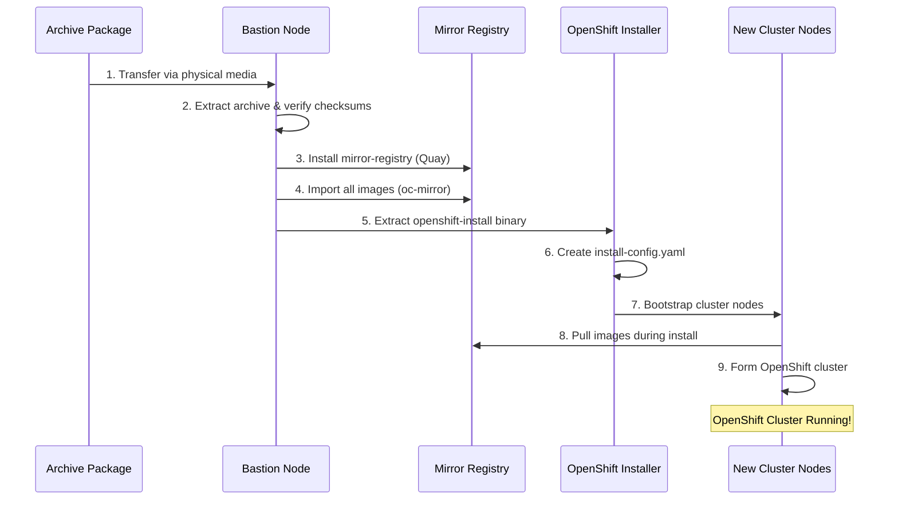
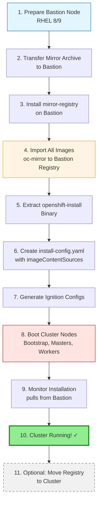

# Bootstrap Installation Guide - Fresh OpenShift in Disconnected Environment

## Overview

This guide explains how to use the mirror pipeline artifacts to install a **brand new OpenShift cluster** in a disconnected (air-gapped) environment where no cluster exists yet.

## The Bootstrap Challenge

Unlike updating an existing disconnected cluster, a fresh installation faces a chicken-and-egg problem:
- OpenShift installation requires pulling images from a registry
- Our pipeline assumes a registry exists within an OpenShift cluster
- But the cluster doesn't exist yet!

## Solution: External Mirror Registry

The solution is to set up a **standalone mirror registry on a bastion/helper node** before installing OpenShift.

### Architecture for Bootstrap



## Prerequisites

### Bastion/Helper Node Requirements

- **Operating System**: RHEL 8.6+ or RHEL 9.0+
- **Storage**: 500GB+ available space
- **RAM**: 16GB minimum
- **CPU**: 4 cores minimum
- **Network**: 
  - Connectivity to future OpenShift cluster nodes
  - Hostname resolvable by cluster nodes
  - Firewall rules allow registry traffic (port 8443)

### Required Files from Mirror Archive

From your mirror package (e.g., `mirror-v2026.05.06.001-scheduled.tar.gz`):
- All images in `images/oc-mirror-workspace/`
- `MANIFEST.yaml`
- `CHECKSUMS.sha256`

### Additional Tools Needed (included in enhanced archive)

- `mirror-registry` binary
- `openshift-install` binary
- `oc` CLI
- `oc-mirror` CLI

## Step-by-Step Installation Process

### Phase 1: Prepare Bastion Node

#### 1.1 Install Bastion Node

```bash
# Install RHEL 8 or 9 on physical or virtual machine
# Register with Red Hat (if internet available for initial setup)
# Or use offline RHEL installation

# Update system (if connected, or from local repos)
sudo dnf update -y

# Install required packages
sudo dnf install -y podman httpd-tools wget jq
```

#### 1.2 Transfer Mirror Archive to Bastion

```bash
# Copy archive from physical media to bastion
# Assuming media mounted at /mnt/usb

cp /mnt/usb/mirror-v2026.05.06.001-scheduled.tar.gz /opt/
cd /opt
tar -xzf mirror-v2026.05.06.001-scheduled.tar.gz
cd mirror-v2026.05.06.001-scheduled

# Verify checksums
sha256sum -c CHECKSUMS.sha256
```

### Phase 2: Install Mirror Registry

#### 2.1 Install mirror-registry

```bash
# Extract mirror-registry tool from archive
cd /opt/mirror-v2026.05.06.001-scheduled/artifacts/binaries
chmod +x mirror-registry

# Install Quay registry on bastion
# This creates a local Quay instance with podman
./mirror-registry install \
  --quayHostname $(hostname -f) \
  --quayRoot /opt/quay-install \
  --quayStorage /opt/quay-storage \
  --pgStorage /opt/pg-data \
  --initPassword changeme123 \
  --initUser admin

# Output shows:
# - Registry URL: https://<bastion-hostname>:8443
# - Admin credentials
# - Pull secret location
```

**Important**: Save the generated pull secret! You'll need it for:
- Importing images
- OpenShift installation

#### 2.2 Configure Firewall

```bash
# Allow registry traffic
sudo firewall-cmd --permanent --add-port=8443/tcp
sudo firewall-cmd --reload

# Verify registry is accessible
curl -k https://$(hostname -f):8443/health/instance
```

#### 2.3 Trust Registry Certificate

```bash
# Copy registry CA cert to system trust
sudo cp /opt/quay-install/quay-rootCA/rootCA.pem \
  /etc/pki/ca-trust/source/anchors/quay-ca.crt

sudo update-ca-trust extract
```

### Phase 3: Import Mirror Content

#### 3.1 Prepare oc-mirror Workspace

```bash
# Navigate to images directory in archive
cd /opt/mirror-v2026.05.06.001-scheduled/images/oc-mirror-workspace

# Set up authentication
export REGISTRY_AUTH_FILE=/opt/quay-install/quay-pull-secret.json

# The workspace already contains all mirrored content from connected environment
```

#### 3.2 Import Images to Local Registry

```bash
# Run oc-mirror in publish mode to push to local registry
# This populates the bastion registry with all content

oc-mirror --from ./mirror_seq1_000000.tar \
  docker://$(hostname -f):8443

# This will take 1-4 hours depending on content size
# Monitor progress - you'll see images being pushed
```

**Alternative Method** (if oc-mirror workspace is in file format):

```bash
# Point oc-mirror to your local registry as destination
# Create a simple imageset config pointing to local registry

cat > /tmp/publish-config.yaml <<EOF
kind: ImageSetConfiguration
apiVersion: mirror.openshift.io/v1alpha2
storageConfig:
  registry:
    imageURL: $(hostname -f):8443/mirror/metadata:latest
    skipTLS: false
EOF

# Publish from workspace to local registry
oc-mirror --config /tmp/publish-config.yaml \
  --from file://./mirror \
  docker://$(hostname -f):8443
```

#### 3.3 Verify Images Available

```bash
# Check images are in registry
curl -k -u admin:changeme123 \
  https://$(hostname -f):8443/api/v1/repository?namespace=openshift4

# Query for specific image
curl -k -u admin:changeme123 \
  https://$(hostname -f):8443/api/v1/repository/openshift4/ose-cli/tag/
```

### Phase 4: Prepare OpenShift Installation

#### 4.1 Extract Installation Tools

```bash
# Extract openshift-install and oc binaries from archive
cd /opt/mirror-v2026.05.06.001-scheduled/artifacts/binaries

tar -xzf openshift-install-linux-*.tar.gz
tar -xzf openshift-client-linux-*.tar.gz

sudo mv openshift-install oc kubectl /usr/local/bin/
chmod +x /usr/local/bin/openshift-install /usr/local/bin/oc
```

#### 4.2 Create Install Configuration

```bash
# Create installation directory
mkdir -p /opt/openshift-install
cd /opt/openshift-install

# Generate base install-config.yaml
# (You'll need your pull secret and SSH key)
cat > install-config.yaml <<EOF
apiVersion: v1
baseDomain: example.com
metadata:
  name: ocp-prod
networking:
  networkType: OVNKubernetes
  clusterNetwork:
  - cidr: 10.128.0.0/14
    hostPrefix: 23
  serviceNetwork:
  - 172.30.0.0/16
  machineNetwork:
  - cidr: 10.0.0.0/16
compute:
- name: worker
  replicas: 3
controlPlane:
  name: master
  replicas: 3
platform:
  # Your platform config (vsphere, baremetal, etc.)
  none: {}
pullSecret: '$(cat /opt/quay-install/quay-pull-secret.json | jq -c .)'
sshKey: '$(cat ~/.ssh/id_rsa.pub)'
additionalTrustBundle: |
$(cat /etc/pki/ca-trust/source/anchors/quay-ca.crt | sed 's/^/  /')
imageContentSources:
- mirrors:
  - $(hostname -f):8443/openshift/release
  source: quay.io/openshift-release-dev/ocp-v4.0-art-dev
- mirrors:
  - $(hostname -f):8443/openshift/release-images
  source: quay.io/openshift-release-dev/ocp-release
EOF
```

**Key Configuration Elements:**

1. **pullSecret**: Combined pull secret with bastion registry credentials
2. **additionalTrustBundle**: Bastion registry CA certificate
3. **imageContentSources**: Redirect image pulls to bastion registry

#### 4.3 Get ImageContentSources from oc-mirror

```bash
# oc-mirror generates imageContentSources during mirroring
# Find this in the results directory

cd /opt/mirror-v2026.05.06.001-scheduled/images/oc-mirror-workspace

# Look for imageContentSourcePolicy.yaml
find . -name "imageContentSourcePolicy.yaml" -o -name "catalogSource*.yaml"

# Extract the mirrors section and add to install-config.yaml
cat oc-mirror-workspace/results-*/imageContentSourcePolicy.yaml
```

### Phase 5: Install OpenShift Cluster

#### 5.1 Create Ignition Configs

```bash
cd /opt/openshift-install

# Backup install-config.yaml (it gets consumed)
cp install-config.yaml install-config.yaml.backup

# Generate manifests
openshift-install create manifests --dir=.

# (Optional) Customize manifests if needed
# e.g., set masters as schedulable, add MachineConfigs

# Generate ignition configs
openshift-install create ignition-configs --dir=.

# This creates:
# - bootstrap.ign
# - master.ign
# - worker.ign
```

#### 5.2 Bootstrap Cluster Nodes

This step varies by platform (bare metal, vSphere, etc.):

**For Bare Metal / UPI:**

```bash
# Host ignition files via HTTP
sudo mkdir -p /var/www/html/ignition
sudo cp *.ign /var/www/html/ignition/
sudo chmod 644 /var/www/html/ignition/*.ign

# Start HTTP server
sudo systemctl start httpd
sudo systemctl enable httpd
sudo firewall-cmd --permanent --add-service=http
sudo firewall-cmd --reload

# Boot cluster nodes:
# - Bootstrap node with bootstrap.ign
# - 3 master nodes with master.ign
# - 3+ worker nodes with worker.ign

# Each node should specify:
# coreos.inst.install_dev=/dev/sda
# coreos.inst.ignition_url=http://<bastion-ip>/ignition/<role>.ign
```

**For VMware vSphere:**

```bash
# Use govc or vCenter UI to deploy VMs with ignition
# Ignition can be provided via vApp properties or HTTP
```

#### 5.3 Monitor Installation

```bash
cd /opt/openshift-install

# Monitor bootstrap process
openshift-install wait-for bootstrap-complete --dir=. --log-level=info

# Watch for:
# - Bootstrap node starts
# - Masters pull images from bastion registry
# - etcd cluster forms
# - Control plane operators start
# - Bootstrap completes (20-30 minutes)

# After bootstrap complete, remove bootstrap node
# Then wait for installation to complete

openshift-install wait-for install-complete --dir=. --log-level=info

# This waits for:
# - All cluster operators to be available
# - Worker nodes to join
# - Installation complete (can take 30-60 minutes total)
```

### Phase 6: Post-Installation Configuration

#### 6.1 Access Cluster

```bash
# Set KUBECONFIG
export KUBECONFIG=/opt/openshift-install/auth/kubeconfig

# Verify cluster access
oc get nodes
oc get co  # Cluster operators

# Get console URL
oc whoami --show-console

# Get kubeadmin password
cat /opt/openshift-install/auth/kubeadmin-password
```

#### 6.2 Configure Operator Hub to Use Mirror

The cluster is now running and pulling from bastion registry. To install operators:

```bash
# Apply catalog sources from oc-mirror results
cd /opt/mirror-v2026.05.06.001-scheduled/images/oc-mirror-workspace

# Find and apply catalogSource manifests
find . -name "catalogSource*.yaml" -exec oc apply -f {} \;

# Verify operator catalogs are available
oc get catalogsources -n openshift-marketplace
oc get packagemanifests | head
```

#### 6.3 Approve Worker CSRs (if needed)

```bash
# Check for pending CSRs
oc get csr

# Approve pending CSRs for workers
oc get csr -o name | xargs oc adm certificate approve
```

### Phase 7: (Optional) Migrate Registry to Cluster

Once the cluster is running, you can optionally move the registry into the cluster:

#### 7.1 Install Quay Operator on Cluster

```bash
# Apply Quay operator subscription (from archive or manually)
oc apply -f /opt/mirror-v2026.05.06.001-scheduled/operators/quay-operator-subscription.yaml

# Wait for operator to install
oc get csv -n openshift-operators
```

#### 7.2 Create In-Cluster Quay Registry

```bash
# Create namespace for Quay
oc new-project quay-enterprise

# Create QuayRegistry custom resource
cat <<EOF | oc apply -f -
apiVersion: quay.redhat.com/v1
kind: QuayRegistry
metadata:
  name: mirror-registry
  namespace: quay-enterprise
spec:
  components:
    - kind: clair
      managed: true
    - kind: postgres
      managed: true
    - kind: objectstorage
      managed: true
    - kind: redis
      managed: true
    - kind: route
      managed: true
    - kind: mirror
      managed: true
    - kind: quay
      managed: true
EOF

# Wait for Quay to be ready (10-15 minutes)
oc get quayregistry mirror-registry -n quay-enterprise -w
```

#### 7.3 Mirror Content to In-Cluster Registry

```bash
# Use oc-mirror or skopeo to copy from bastion to cluster registry
# Get cluster Quay route
CLUSTER_QUAY=$(oc get route mirror-registry-quay -n quay-enterprise -o jsonpath='{.spec.host}')

# Use oc-mirror to sync
oc-mirror --from docker://$(hostname -f):8443 \
  docker://$CLUSTER_QUAY
```

#### 7.4 Update ImageContentSourcePolicy

```bash
# Create new ICSP pointing to in-cluster registry
cat <<EOF | oc apply -f -
apiVersion: operator.openshift.io/v1alpha1
kind: ImageContentSourcePolicy
metadata:
  name: mirror-registry-cluster
spec:
  repositoryDigestMirrors:
  - mirrors:
    - ${CLUSTER_QUAY}/openshift/release
    source: quay.io/openshift-release-dev/ocp-v4.0-art-dev
  - mirrors:
    - ${CLUSTER_QUAY}/openshift/release-images
    source: quay.io/openshift-release-dev/ocp-release
EOF

# This triggers node reboots to apply new configuration
# Monitor node reboots
oc get mcp -w
```

## Workflow Summary



## Troubleshooting Bootstrap Installation

### Issue: Nodes can't pull images

**Symptoms:**
- Bootstrap or masters stuck
- Image pull errors in node logs

**Solutions:**
```bash
# Verify registry accessible from nodes
curl -k https://<bastion-hostname>:8443/health/instance

# Check DNS resolution
nslookup <bastion-hostname>

# Verify firewall
sudo firewall-cmd --list-all

# Check registry has images
curl -k -u admin:password https://<bastion>:8443/api/v1/repository?namespace=openshift4
```

### Issue: Certificate trust issues

**Symptoms:**
- x509 certificate errors
- TLS handshake failures

**Solutions:**
```bash
# Verify cert is in additionalTrustBundle in install-config.yaml
# Verify cert is in /etc/pki/ca-trust on bastion
# Re-run update-ca-trust extract
```

### Issue: imageContentSources not working

**Symptoms:**
- Still trying to pull from quay.io/registry.redhat.io
- Image pull timeouts

**Solutions:**
```bash
# Verify imageContentSources in install-config.yaml
# Ensure mirrors match exactly what's in oc-mirror output
# Check repository names in bastion registry match
```

## Next Steps After Cluster Installation

1. **Install Operators from Mirrored Catalogs**
   ```bash
   oc get packagemanifests
   # Install operators as normal via OperatorHub UI or YAML
   ```

2. **Set Up Pipeline for Future Updates**
   ```bash
   # Install Pipelines operator (from mirror)
   # Deploy import pipeline
   # Use for ongoing updates from connected environment
   ```

3. **Decommission or Keep Bastion Registry**
   - Keep if you want external registry for troubleshooting
   - Migrate to in-cluster Quay for self-sufficiency

## Additional Resources

- [OpenShift Disconnected Installation Docs](https://docs.openshift.com/container-platform/latest/installing/disconnected_install/index.html)
- [mirror-registry Tool](https://docs.redhat.com/en/documentation/openshift_container_platform/4.15/html/installing/disconnected-installation-mirroring#installing-mirroring-creating-registry)
- [ImageContentSourcePolicy](https://docs.openshift.com/container-platform/latest/openshift_images/image-configuration.html#images-configuration-registry-mirror_image-configuration)
