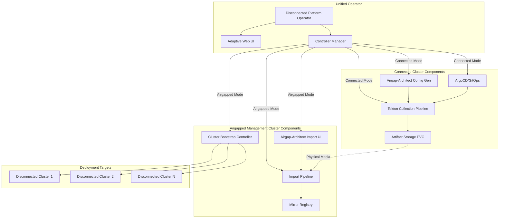

# Future Vision: Unified Disconnected OpenShift Platform Operator

**Status:** Design Proposal  
**Date:** 2026-05-08  
**Target:** Phase 5+ (Post-Hardening)

## Vision Statement

Create a **unified operator-based platform** that orchestrates the complete disconnected OpenShift lifecycle:
- Configuration generation via integrated airgap-architect UI
- Automated artifact collection pipelines on connected clusters
- Artifact packaging and versioning for physical media transport
- Import automation and cluster bootstrapping on airgapped management clusters
- GitOps-driven deployment workflows
- Self-contained, signed, SBOM-tracked container distribution

**Goal:** Eliminate manual processes, field guides, and CLI-driven workflows by providing a context-aware UI that adapts to connected vs. airgapped environments.

---

## Architecture Overview



---

## Component Deep Dive

### 1. Disconnected Platform Operator

**Responsibilities:**
- Detect deployment environment (connected vs. airgapped)
- Manage lifecycle of all components
- Provide unified CRDs for configuration
- Coordinate between airgap-architect and pipeline components
- Health monitoring and status reporting

**Custom Resources:**

```yaml
apiVersion: disconnected.openshift.io/v1alpha1
kind: DisconnectedPlatform
metadata:
  name: disconnected-platform
spec:
  mode: connected | airgapped
  
  # Connected cluster configuration
  connected:
    collectionSchedule: "0 2 * * 0"  # Weekly Sunday 2am
    mirrorRegistry: quay.example.com/mirror
    artifactStorage:
      storageClass: gp3
      size: 2Ti
    gitOpsRepo: https://github.com/org/disconnected-configs
    
  # Airgapped cluster configuration  
  airgapped:
    managementCluster: true
    mirrorRegistry: quay.internal:8443/mirror
    bootstrapEnabled: true
    importPath: /mnt/physical-media
    
status:
  phase: Ready | Collecting | Importing | Error
  lastCollection:
    version: v2026.05.06.001-scheduled
    timestamp: "2026-05-06T02:00:00Z"
    size: 145GB
  components:
    - name: airgap-architect
      status: Running
      url: https://airgap-architect.apps.cluster.example.com
    - name: collection-pipeline
      status: Ready
      lastRun: "2026-05-06T02:00:00Z"
```

```yaml
apiVersion: disconnected.openshift.io/v1alpha1
kind: ClusterBootstrap
metadata:
  name: production-cluster-01
spec:
  version: v2026.05.06.001-scheduled
  platform: vsphere | baremetal | aws-govcloud | azure-gov | nutanix
  
  # References airgap-architect generated config
  installConfig:
    secretRef: production-cluster-01-install-config
    
  # For agent-based installs
  agentConfig:
    secretRef: production-cluster-01-agent-config
    
  # Mirror configuration
  mirrorRegistry: quay.internal:8443/mirror
  pullSecret:
    secretRef: mirror-pull-secret
    
  # Network configuration
  network:
    clusterNetwork: 10.128.0.0/14
    serviceNetwork: 172.30.0.0/16
    
  # Node configuration
  controlPlane:
    replicas: 3
  compute:
    replicas: 3
    
status:
  phase: Pending | Installing | Complete | Failed
  installLog: https://console.example.com/bootstrap/production-cluster-01
  kubeconfig:
    secretRef: production-cluster-01-kubeconfig
```

---

### 2. Integrated Airgap-Architect

**Enhanced Capabilities:**

#### Connected Cluster Mode
- **Config Generation UI** (existing)
- **NEW: Pipeline Trigger Integration**
  - "Save and Run Collection" button
  - Creates PipelineRun with generated ImageSetConfiguration
  - Shows live pipeline execution status
  - Links to Tekton dashboard
  
- **NEW: GitOps Sync**
  - Commits generated configs to GitOps repo
  - Triggers ArgoCD sync for pipeline deployment
  - Version control for configuration changes

#### Airgapped Cluster Mode
- **Import Wizard** 
  - Guides through archive validation
  - Checksums verification UI
  - oc-mirror execution with progress tracking
  - Registry population status
  
- **NEW: Cluster Bootstrap UI**
  - Visual cluster creation wizard
  - Platform-specific configuration forms
  - Real-time installation progress
  - Log streaming from openshift-install
  - **Eliminates need for FIELD_MANUAL.md** - UI is the guide
  
- **NEW: Post-Install Configuration**
  - Operator catalog activation
  - Day-2 configuration application
  - Monitoring setup
  - GitOps deployment

**Technical Implementation:**
```typescript
// Airgap-Architect Component Enhancement
interface AirgapArchitectConfig {
  mode: 'connected' | 'airgapped';
  
  // Connected mode features
  pipelineTrigger?: {
    enabled: boolean;
    namespace: string;
    serviceAccount: string;
  };
  
  gitOpsIntegration?: {
    enabled: boolean;
    repoUrl: string;
    branch: string;
    path: string;
  };
  
  // Airgapped mode features
  bootstrapController?: {
    enabled: boolean;
    namespace: string;
  };
  
  importAutomation?: {
    enabled: boolean;
    watchPath: string;
  };
}
```

---

### 3. Operator-Managed Pipeline Components

**What Changes:**
- Tekton Pipelines → Managed by operator
- Pipeline Tasks → Packaged as operator resources
- Storage → Provisioned via operator CRDs
- RBAC → Managed automatically

**Benefits:**
- Single `oc apply -f operator.yaml` deployment
- Automatic upgrades via OLM
- Unified configuration via CRDs
- Integrated monitoring/alerting

**Operator Bundle Structure:**
```
disconnected-platform-operator/
├── bundle/
│   ├── manifests/
│   │   ├── disconnected-platform.clusterserviceversion.yaml
│   │   ├── disconnectedplatform.crd.yaml
│   │   ├── clusterbootstrap.crd.yaml
│   │   └── collectionpipeline.crd.yaml
│   ├── metadata/
│   │   └── annotations.yaml
│   └── tests/
├── config/
│   ├── manager/
│   │   └── manager.yaml
│   ├── rbac/
│   │   ├── role.yaml
│   │   └── role_binding.yaml
│   └── samples/
│       ├── disconnected-platform-connected.yaml
│       └── disconnected-platform-airgapped.yaml
├── controllers/
│   ├── disconnectedplatform_controller.go
│   ├── clusterbootstrap_controller.go
│   └── collectionpipeline_controller.go
├── web/
│   ├── airgap-architect-integration/
│   └── operator-console-plugin/
└── Dockerfile
```

---

### 4. Signed Container with SBOM

**Package Contents:**
```
disconnected-platform-operator:v1.0.0
├── /usr/local/bin/
│   ├── manager                    # Operator binary
│   ├── oc-mirror                  # Bundled oc-mirror v2
│   ├── oc                         # OpenShift CLI
│   ├── helm                       # Helm CLI
│   └── openshift-install          # Installer (airgapped mode)
├── /opt/airgap-architect/
│   ├── server                     # Node.js server
│   ├── app/                       # React build
│   └── db/                        # Pre-seeded operator catalog DB
├── /manifests/
│   ├── operator-install.yaml
│   ├── tekton-tasks/              # Pipeline task definitions
│   └── examples/                  # Sample configurations
└── /sbom/
    ├── sbom.json                  # CycloneDX SBOM
    ├── signatures/                # Cosign signatures
    └── attestations/              # SLSA attestations
```

**Signing and Verification:**
```bash
# Build with SBOM generation
buildah bud \
  --format oci \
  --sbom cyclonedx \
  -t disconnected-platform-operator:v1.0.0 .

# Sign with cosign
cosign sign --key cosign.key \
  registry.example.com/disconnected-platform-operator:v1.0.0

# Verify on airgapped cluster
cosign verify --key cosign.pub \
  --offline \
  quay.internal:8443/disconnected-platform-operator:v1.0.0
```

**Distribution:**
- Included in artifact collections automatically
- Part of oc-mirror additionalImages
- Versioned with platform releases

---

### 5. GitOps Integration

**Connected Cluster:**
```yaml
# ArgoCD Application
apiVersion: argoproj.io/v1alpha1
kind: Application
metadata:
  name: disconnected-collections
spec:
  source:
    repoURL: https://github.com/org/disconnected-configs
    path: collections/
  destination:
    server: https://kubernetes.default.svc
    namespace: disconnected-platform
  syncPolicy:
    automated:
      prune: true
      selfHeal: true
```

**Repo Structure:**
```
disconnected-configs/
├── collections/
│   ├── base/
│   │   ├── imageset-config.yaml
│   │   └── kustomization.yaml
│   └── overlays/
│       ├── weekly/
│       │   └── kustomization.yaml
│       └── monthly/
│           └── kustomization.yaml
├── bootstrap/
│   ├── production-cluster-01/
│   │   ├── install-config.yaml (sealed)
│   │   └── agent-config.yaml
│   └── production-cluster-02/
└── platform/
    └── operator-config.yaml
```

**Workflow:**
1. User generates config in airgap-architect UI
2. Clicks "Save to GitOps"
3. Operator commits to repo
4. ArgoCD syncs and triggers pipeline
5. Collection runs automatically

---

## Deployment Scenarios

### Scenario 1: Connected Cluster Setup

```bash
# 1. Deploy operator
oc create namespace disconnected-platform
oc apply -f operator-install.yaml

# 2. Configure for connected mode
cat <<EOF | oc apply -f -
apiVersion: disconnected.openshift.io/v1alpha1
kind: DisconnectedPlatform
metadata:
  name: disconnected-platform
spec:
  mode: connected
  connected:
    collectionSchedule: "0 2 * * 0"
    mirrorRegistry: quay.example.com/mirror
    artifactStorage:
      storageClass: gp3
      size: 2Ti
    gitOpsRepo: https://github.com/org/disconnected-configs
EOF

# 3. Access UI
oc get route -n disconnected-platform airgap-architect
# Opens browser to https://airgap-architect.apps.cluster.example.com

# 4. Use UI to:
#    - Generate ImageSetConfiguration
#    - Click "Save and Run Collection"
#    - Monitor pipeline in integrated view
#    - Download archive metadata for transfer
```

---

### Scenario 2: Airgapped Management Cluster Setup

```bash
# 1. Transfer operator image via physical media
# (operator image included in collection archive)

# 2. Import operator
podman load -i disconnected-platform-operator-v1.0.0.tar
podman tag localhost/disconnected-platform-operator:v1.0.0 \
  quay.internal:8443/operators/disconnected-platform-operator:v1.0.0
podman push quay.internal:8443/operators/disconnected-platform-operator:v1.0.0

# 3. Deploy operator
oc create namespace disconnected-platform
oc apply -f operator-install.yaml

# 4. Configure for airgapped mode
cat <<EOF | oc apply -f -
apiVersion: disconnected.openshift.io/v1alpha1
kind: DisconnectedPlatform
metadata:
  name: disconnected-platform
spec:
  mode: airgapped
  airgapped:
    managementCluster: true
    mirrorRegistry: quay.internal:8443/mirror
    bootstrapEnabled: true
    importPath: /mnt/physical-media
EOF

# 5. Access UI
oc get route -n disconnected-platform airgap-architect
# Opens browser to https://airgap-architect.apps.internal.local

# 6. Use UI to:
#    - Import archives from physical media
#    - Bootstrap new clusters (replaces manual install)
#    - Monitor cluster installations
#    - Configure day-2 operations
```

---

### Scenario 3: Bootstrap New Cluster from Airgapped Management Cluster

**Via UI (Replaces FIELD_MANUAL.md):**

1. **Access Bootstrap UI**
   ```
   https://airgap-architect.apps.internal.local/bootstrap
   ```

2. **Fill Wizard Form:**
   - Platform: vSphere
   - Cluster Name: production-cluster-03
   - OpenShift Version: 4.15.12 (from imported archive v2026.05.06.001)
   - vCenter Details: [form fields]
   - Network Configuration: [form fields]
   - Node Configuration: [form fields]

3. **Click "Create Cluster"**
   - Operator creates ClusterBootstrap CR
   - Controller generates ignition configs
   - Provisions VMs (if platform supports automation)
   - Streams installation logs to UI
   - Shows progress: Bootstrap → Control Plane → Workers → Complete

4. **Access New Cluster**
   - UI shows kubeconfig download button
   - Console URL displayed
   - Day-2 checklist presented

**Via CLI (For automation):**
```bash
cat <<EOF | oc apply -f -
apiVersion: disconnected.openshift.io/v1alpha1
kind: ClusterBootstrap
metadata:
  name: production-cluster-03
spec:
  version: v2026.05.06.001-scheduled
  platform: vsphere
  installConfig:
    secretRef: production-cluster-03-install-config
  agentConfig:
    secretRef: production-cluster-03-agent-config
  mirrorRegistry: quay.internal:8443/mirror
  pullSecret:
    secretRef: mirror-pull-secret
EOF

# Monitor
oc get clusterbootstrap production-cluster-03 -w
oc logs -f -n disconnected-platform \
  -l app=bootstrap-controller,cluster=production-cluster-03
```

---

## Technical Implementation Phases

### Phase 5A: Operator Foundation (Weeks 9-10)
- [ ] Operator SDK scaffolding
- [ ] DisconnectedPlatform CRD
- [ ] Basic controller logic (mode detection)
- [ ] Pipeline component management
- [ ] Initial RBAC and deployment manifests

### Phase 5B: Airgap-Architect Integration (Weeks 11-12)
- [ ] Embed airgap-architect as operator component
- [ ] Add Kubernetes API client to airgap-architect
- [ ] Implement PipelineRun creation from UI
- [ ] Add mode detection (connected vs. airgapped UI)
- [ ] GitOps commit automation

### Phase 5C: Bootstrap Controller (Weeks 13-14)
- [ ] ClusterBootstrap CRD
- [ ] Bootstrap controller implementation
- [ ] openshift-install wrapper
- [ ] Installation log streaming
- [ ] Multi-platform support (vSphere, Baremetal first)

### Phase 5D: Container Packaging & Signing (Week 15)
- [ ] Multi-stage Dockerfile with all components
- [ ] SBOM generation integration
- [ ] Cosign signing automation
- [ ] Offline verification scripts
- [ ] Documentation for airgapped import

### Phase 5E: GitOps & Automation (Week 16)
- [ ] ArgoCD integration examples
- [ ] Configuration repo templates
- [ ] Webhook handling for auto-sync
- [ ] Backup/restore for configurations

### Phase 6: Production Hardening (Weeks 17-20)
- [ ] HA operator deployment
- [ ] Leader election
- [ ] Metrics and monitoring
- [ ] Alert rules
- [ ] Comprehensive testing
- [ ] Security scanning
- [ ] Documentation and training materials
- [ ] OLM catalog entry

---

## User Experience Improvements

### Before (Current State)

**Connected Cluster:**
1. Manually create imageset-config.yaml
2. Apply Tekton pipeline manifests
3. Create PipelineRun
4. Check logs via oc command
5. Download archive from PVC
6. Transfer to physical media

**Airgapped Cluster:**
1. Read 50-page FIELD_MANUAL.md
2. Extract binaries manually
3. Configure install-config.yaml by hand
4. Run openshift-install commands
5. Monitor via CLI
6. Troubleshoot with logs

### After (With Operator)

**Connected Cluster:**
1. Open UI → Generate Config (wizard)
2. Click "Save and Run"
3. Monitor in UI (live progress)
4. Get notification when ready
5. Download metadata (archive auto-staged)

**Airgapped Cluster:**
1. Mount physical media
2. Open UI → Import Archive (drag & drop)
3. Open UI → Bootstrap → New Cluster (form)
4. Fill form (like cloud console)
5. Click "Create" 
6. Monitor in UI (live progress)
7. Download kubeconfig when complete

**Field Manual? What field manual? The UI IS the guide.**

---

## Value Proposition

### For Platform Teams
- **60% reduction** in deployment time (UI vs. manual)
- **Eliminate documentation drift** (UI always matches code)
- **Reduce training burden** (wizard vs. reading guides)
- **GitOps-native** (configuration as code)
- **Single source of truth** (operator manages all components)

### For Security Teams
- **Signed container** with attestations
- **SBOM included** for vulnerability scanning
- **Offline verification** built-in
- **Audit trail** via CRs and Git commits
- **RBAC-enforced** workflows

### For Operations Teams
- **One-click deployments** for new clusters
- **Self-service** cluster provisioning
- **Integrated monitoring** and alerts
- **Automated upgrades** via OLM
- **Standardized configurations** across fleet

---

## Success Metrics

### Technical KPIs
- Time to bootstrap new cluster: **< 2 hours** (vs. 8+ hours manual)
- Configuration errors: **< 5%** (vs. 40% manual)
- Training time for new engineer: **< 4 hours** (vs. 2 days)
- Collection automation: **100%** scheduled collections succeed

### Adoption KPIs
- **80%+ teams** adopt operator over manual process
- **90%+ clusters** bootstrapped via operator within 6 months
- **50%+ reduction** in support tickets for disconnected installs
- **100% SBOM compliance** for security audits

---

## Open Questions & Decisions Needed

1. **Should operator support multiple mirror registries?**
   - Use case: Different registries for different security zones
   
2. **How to handle platform-specific bootstrap automation?**
   - vSphere: Full automation possible (Terraform?)
   - Baremetal: Agent-based installer integration
   - Cloud GovCloud: Limited automation
   
3. **GitOps repository: shared or per-cluster?**
   - Shared: Easier management, but blast radius concerns
   - Per-cluster: Isolated, but more repos to manage
   
4. **UI deployment: operator pod or separate deployment?**
   - Operator pod: Simpler, but larger image
   - Separate: More flexible, but more components
   
5. **How to handle operator updates in airgapped env?**
   - Include in regular artifact collections?
   - Separate update mechanism?

---

## Next Steps

### Immediate (Next 2 Weeks)
1. Review and refine this design with stakeholders
2. Create detailed technical specifications for Phase 5A
3. Set up operator development environment
4. Begin airgap-architect fork/enhancement planning
5. Create PoC for mode detection and UI adaptation

### Short Term (Next Month)
1. Implement basic operator (Phase 5A)
2. Integrate with existing pipeline components
3. Demo to early adopters
4. Gather feedback and iterate

### Long Term (Next Quarter)
1. Complete all Phase 5 components
2. Beta testing with real clusters
3. Security review and penetration testing
4. Create OLM catalog entry
5. General availability release

---

## Contributing to Airgap-Architect

**Enhancements to Propose:**

1. **Kubernetes API Client**
   ```typescript
   // Add optional k8s integration
   interface K8sConfig {
     inCluster: boolean;
     namespace: string;
     createPipelineRuns: boolean;
   }
   ```

2. **Mode Detection**
   ```typescript
   // Detect environment and adapt UI
   async function detectEnvironment(): Promise<'standalone' | 'connected' | 'airgapped'> {
     if (process.env.KUBERNETES_SERVICE_HOST) {
       const mode = await checkClusterMode();
       return mode;
     }
     return 'standalone';
   }
   ```

3. **Pipeline Integration API**
   ```typescript
   // POST /api/pipeline/trigger
   interface PipelineTriggerRequest {
     imageSetConfig: string;
     triggerType: 'manual' | 'scheduled' | 'event';
     namespace: string;
   }
   ```

4. **Import Automation**
   ```typescript
   // POST /api/import/start
   interface ImportRequest {
     archivePath: string;
     registryUrl: string;
     credentials: RegistryCredentials;
   }
   ```

**Contribution Strategy:**
- Fork and develop in parallel
- Regular sync with upstream
- Propose features via PRs
- Maintain compatibility with standalone mode
- Document operator-specific features separately

---

## Conclusion

This vision transforms the disconnected OpenShift experience from:
- **CLI-driven, manual, error-prone, documentation-heavy**

To:
- **UI-driven, automated, guided, self-documenting**

The operator becomes the single entry point for all disconnected operations, with airgap-architect providing the human interface. Together, they eliminate the complexity that currently prevents widespread adoption of disconnected OpenShift deployments.

**The field manual becomes obsolete. The UI is the guide. The operator is the engine.**
