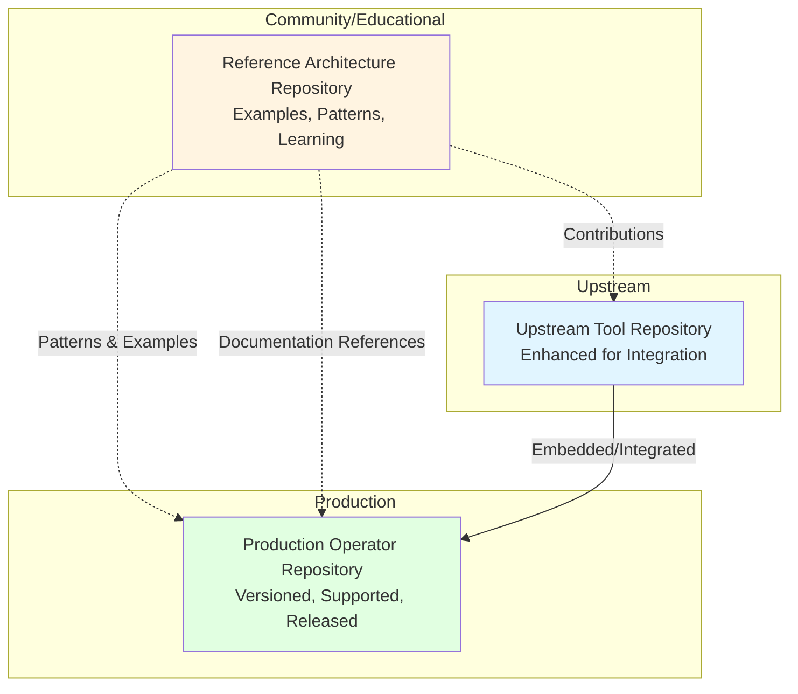

# Reference Architecture Pattern for Airgapped Release Cycles

**Status:** Canonical Guidance  
**Version:** 1.0.0  
**Date:** 2026-05-08  
**Purpose:** Define the standard pattern for implementing airgapped release cycles

---

## Executive Summary

This document defines **THE pattern** for implementing airgapped release cycles for OpenShift and Kubernetes ecosystems. All operators, tools, and implementations should follow this architecture.

**Key Principle:** **Separate reference architectures from production implementations.**

---

## The Three-Repository Pattern

Every airgapped release cycle implementation should consist of **three separate repositories:**



### Repository 1: Reference Architecture

**Purpose:** Educational resource and pattern library

**Examples:**
- `disconnected-mirror-pipeline` (this repository)
- `airgapped-helm-release-reference`
- `operator-airgap-patterns`

**Contains:**
- ✅ Example Tekton/Argo pipelines
- ✅ Sample scripts and utilities
- ✅ Architecture documentation
- ✅ Pattern explanations ("why we did it this way")
- ✅ Integration guides
- ✅ Diagrams and workflows

**Does NOT Contain:**
- ❌ Production operator code
- ❌ Versioned releases for production use
- ❌ Support contracts
- ❌ Formal SBOM/signatures

**Versioning:** Git tags for documentation milestones (optional)

**License:** Apache 2.0 (or similar permissive)

**Support:** Community via GitHub Issues

**Updates:** Continuous - update whenever patterns improve

---

### Repository 2: Production Operator/Tool

**Purpose:** Production-ready, supported implementation

**Examples:**
- `disconnected-platform-operator`
- `airgapped-helm-operator`
- `openshift-mirror-controller`

**Contains:**
- ✅ Production operator code (Go, Python, etc.)
- ✅ CRDs and controllers
- ✅ OLM bundles
- ✅ Helm charts
- ✅ Comprehensive test suites
- ✅ Security scanning and SBOM
- ✅ Container signing
- ✅ Release automation
- ✅ Migration guides

**Does NOT Contain:**
- ❌ Example/reference implementations
- ❌ Learning materials (those live in reference repo)
- ❌ Experimental patterns

**Versioning:** Semantic versioning (v1.0.0, v1.1.0, v2.0.0)

**License:** Apache 2.0, Commercial, or Dual-licensed

**Support:** Commercial support contracts available

**Updates:** Formal releases with deprecation cycles

---

### Repository 3: Enhanced Upstream Tool

**Purpose:** Existing tool enhanced for airgapped workflows

**Examples:**
- `openshift-airgap-architect` (enhanced)
- `helm` (with airgap features)
- `oc-mirror` (community extensions)

**Approach:**
1. **First:** Contribute to upstream project
2. **If necessary:** Maintain fork with integration features
3. **Goal:** Merge fork back to upstream

**Contains:**
- ✅ Kubernetes API integration
- ✅ Mode detection (connected/airgapped)
- ✅ Operator integration hooks
- ✅ Enhanced UI workflows

**Maintains:**
- ✅ Backward compatibility with standalone usage
- ✅ Optional features (disabled by default)
- ✅ Regular sync with upstream

---

## Why This Pattern Works

### 1. Clear Separation of Concerns

| Aspect | Reference Repo | Production Repo | Upstream Tool |
|--------|---------------|-----------------|---------------|
| **Goal** | Teach patterns | Solve problems | Provide capabilities |
| **Users** | Engineers learning | Ops teams deploying | All users |
| **Stability** | Evolving | Stable | Both |
| **Support** | Community | Commercial | Community/Vendor |

### 2. Independent Lifecycles

**Reference Repository:**
```
Day 1: Discover better pattern
Day 2: Update examples
Day 3: Push to main
Users adapt to their needs ✅
```

**Production Repository:**
```
Week 1: Feature proposal
Week 2: Design review
Week 3-4: Implementation
Week 5: Testing
Week 6: Documentation
Week 7: Release v1.1.0
Users upgrade when ready ✅
```

**No conflict!** Each moves at appropriate pace.

### 3. Multiple Consumption Models

Users can choose their path:

**Path A: DIY (Do It Yourself)**
```
1. Study reference architecture
2. Copy patterns that apply
3. Customize for environment
4. Maintain internally
```
*Use case: Large enterprises with platform teams*

**Path B: Adopt Operator**
```
1. Review reference architecture (optional)
2. Install production operator
3. Configure via CRs
4. Get support if needed
```
*Use case: Teams wanting turnkey solution*

**Path C: Hybrid**
```
1. Use operator for core functionality
2. Extend with custom patterns from reference
3. Contribute improvements back
```
*Use case: Advanced users with specific needs*

### 4. Community Growth

**Reference Repo:**
- Attracts learners
- Gathers feedback on patterns
- Identifies common needs
- Low barrier to contribution

**Production Repo:**
- Attracts users
- Gathers production requirements
- Validates patterns at scale
- Higher quality bar for contribution

**Upstream Tool:**
- Benefits entire ecosystem
- Shared maintenance
- Broader adoption

**Flywheel Effect:**
```
More users → More feedback → Better patterns → Better operator → More users
```

---

## Standard Directory Structures

### Reference Architecture Repository

```
<project>-reference/
├── README.md                    # Pattern overview
├── ARCHITECTURE.md              # Detailed architecture
├── docs/
│   ├── patterns/                # Pattern library
│   ├── examples/                # Example configurations
│   ├── integration/             # Integration guides
│   └── operator-specs/          # Specs for production operator
├── pipelines/
│   ├── connected/               # Example collection pipelines
│   └── disconnected/            # Example import pipelines
├── scripts/
│   ├── common/                  # Reusable utilities
│   ├── connected/               # Collection scripts
│   └── disconnected/            # Import scripts
├── config/
│   └── examples/                # Example configurations (gitignored actual)
├── manifests/
│   ├── storage/                 # Example PVCs
│   ├── rbac/                    # Example RBAC
│   └── operators/               # Example subscriptions
└── templates/                   # YAML templates

Key: Everything is "example" or "pattern"
```

### Production Operator Repository

```
<project>-operator/
├── README.md                    # Installation guide
├── PROJECT                      # Operator SDK metadata
├── Makefile                     # Build automation
├── Dockerfile                   # Multi-stage build
├── main.go                      # Entry point
├── api/
│   └── v1alpha1/                # CRD definitions
├── controllers/                 # Controller logic
├── pkg/                         # Internal packages
├── config/
│   ├── crd/                     # Generated CRDs
│   ├── rbac/                    # Operator RBAC
│   ├── manager/                 # Operator deployment
│   └── samples/                 # CR examples
├── bundle/                      # OLM bundle
├── charts/                      # Helm charts
├── test/
│   ├── e2e/                     # E2E tests
│   └── integration/             # Integration tests
├── docs/
│   ├── installation.md          # How to install
│   ├── configuration.md         # API reference
│   ├── operations.md            # Day-2 operations
│   └── troubleshooting.md       # Common issues
└── .github/
    └── workflows/               # CI/CD automation

Key: Production-ready code and tests
```

---

## Implementation Checklist

When creating a new airgapped release cycle implementation, follow this checklist:

### Phase 1: Reference Architecture (Weeks 1-8)

- [ ] Create reference repository
- [ ] Document the problem being solved
- [ ] Create example pipelines/workflows
- [ ] Write pattern documentation
- [ ] Identify upstream tools to enhance
- [ ] Create example scripts
- [ ] Validate with prototype deployment
- [ ] Gather community feedback

**Deliverable:** Working examples that demonstrate the pattern

### Phase 2: Upstream Contributions (Weeks 9-12)

- [ ] Contact upstream maintainers
- [ ] Propose enhancements
- [ ] Submit PRs for generic features
- [ ] Decide: merge or fork
- [ ] Document integration approach
- [ ] Test upstream changes

**Deliverable:** Upstream tool ready for operator integration

### Phase 3: Operator Scaffolding (Weeks 13-14)

- [ ] Create operator repository
- [ ] Initialize with Operator SDK / Kubebuilder
- [ ] Define CRDs based on patterns
- [ ] Set up CI/CD pipelines
- [ ] Configure security scanning
- [ ] Establish release process

**Deliverable:** Empty operator structure ready for development

### Phase 4: Operator Implementation (Weeks 15-20)

- [ ] Implement controllers
- [ ] Integrate upstream tool
- [ ] Add webhooks for validation
- [ ] Create comprehensive tests
- [ ] Build OLM bundle
- [ ] Generate SBOM
- [ ] Sign containers
- [ ] Write user documentation

**Deliverable:** Alpha version of operator (v0.1.0)

### Phase 5: Production Hardening (Weeks 21-24)

- [ ] Beta testing with real users
- [ ] Performance optimization
- [ ] HA and scaling tests
- [ ] Security audit
- [ ] Documentation review
- [ ] Migration guides
- [ ] Monitoring/alerting setup
- [ ] Support process defined

**Deliverable:** Production-ready v1.0.0 release

### Phase 6: Ongoing Maintenance

- [ ] Monitor issues and feedback
- [ ] Regular security patching
- [ ] Feature enhancements
- [ ] Update reference architecture with learnings
- [ ] Contribute improvements to upstream
- [ ] Expand test coverage

**Deliverable:** Sustained, supported product

---

## Naming Conventions

### Reference Repository

```
<domain>-<function>-reference
<domain>-<function>-patterns
<domain>-<function>-pipeline

Examples:
- disconnected-mirror-pipeline
- airgapped-helm-reference
- operator-airgap-patterns
- k8s-offline-deployment-reference
```

### Production Operator Repository

```
<domain>-<function>-operator
<domain>-<function>-controller

Examples:
- disconnected-platform-operator
- airgapped-helm-operator
- offline-deployment-controller
```

### Enhanced Upstream Repository (if forking)

```
<upstream-tool>-<integration>
<upstream-tool>-operator

Examples:
- airgap-architect-operator
- helm-disconnected
```

---

## Cross-Repository Communication

### Documentation Linking

**Reference Repo → Operator:**
```markdown
For production deployments, see the 
[Disconnected Platform Operator](https://github.com/org/disconnected-platform-operator)
which implements these patterns.
```

**Operator Repo → Reference:**
```markdown
For detailed pattern explanations and customization options, see the
[Reference Architecture](https://github.com/org/disconnected-mirror-pipeline).
```

### Issue Linking

**In operator issues:**
```markdown
This implements the pattern documented in:
disconnected-mirror-pipeline#42
```

**In reference issues:**
```markdown
Production implementation tracked in:
disconnected-platform-operator#123
```

### Shared Roadmap

Maintain a **shared roadmap document** (can live in either repo):

```markdown
# Disconnected Platform Roadmap

## Q2 2026
- **Reference:** Phase 3 automation patterns (disconnected-mirror-pipeline)
- **Operator:** Beta release v0.9.0 (disconnected-platform-operator)
- **Upstream:** Mode detection PR merged (airgap-architect)

## Q3 2026
- **Reference:** Phase 4 optimization patterns
- **Operator:** v1.0.0 GA release
- **Upstream:** Pipeline trigger feature
```

---

## Decision Records

Use Architecture Decision Records (ADRs) to document key choices:

### Example ADR: Why Separate Repositories

```markdown
# ADR-001: Separate Reference and Production Repositories

## Status
Accepted

## Context
Need to provide both learning materials and production tooling.

## Decision
Create separate repositories for reference architecture and production operator.

## Consequences
**Positive:**
- Clear separation of concerns
- Independent versioning
- Different support models
- Cleaner git history

**Negative:**
- Must maintain two repos
- Risk of drift
- Need cross-linking

**Mitigation:**
- Regular sync meetings
- Shared roadmap
- Cross-repository issue linking
```

---

## Anti-Patterns to Avoid

### ❌ Anti-Pattern 1: Mixing Reference and Production

```
BAD:
repo/
├── examples/          # Reference stuff
├── operator/          # Production stuff
└── docs/              # Which docs? For what?

Problems:
- Versioning ambiguous
- Testing conflated
- Users confused
```

### ❌ Anti-Pattern 2: Reference Without Production Path

```
BAD:
- Create reference architecture
- Never build production operator
- Users stuck copying examples forever

Problems:
- No upgrade path
- Fragmented implementations
- No economies of scale
```

### ❌ Anti-Pattern 3: Production Without Reference

```
BAD:
- Build operator only
- No pattern documentation
- "Use the operator or nothing"

Problems:
- No customization path
- Can't adapt to edge cases
- Knowledge not transferable
```

### ❌ Anti-Pattern 4: Forking Upstream Without Contributing Back

```
BAD:
- Fork upstream tool
- Add features
- Never contribute back
- Fork drifts 100+ commits ahead

Problems:
- Maintenance burden
- Miss upstream improvements
- Community doesn't benefit
```

---

## Success Metrics

Track these metrics to validate the pattern:

### Reference Repository

| Metric | Target | Why |
|--------|--------|-----|
| GitHub Stars | 200+ | Community interest |
| Forks | 50+ | Teams adapting patterns |
| Issues (questions) | 20+/month | Active learning |
| Documentation views | 1000+/month | Knowledge transfer |

### Production Operator

| Metric | Target | Why |
|--------|--------|-----|
| GitHub Stars | 500+ | Production adoption |
| Production deployments | 50+ | Real usage |
| Issues (bugs) | < 10 open | Quality |
| Release cadence | Monthly | Active development |
| Test coverage | 85%+ | Reliability |
| MTTR | < 24 hours | Support quality |

### Upstream Contributions

| Metric | Target | Why |
|--------|--------|-----|
| PRs merged | 5+ | Community benefit |
| Features adopted | 80%+ | Alignment |
| Fork drift | < 20 commits | Sustainability |

---

## Real-World Examples

### Example 1: Helm Airgapped Release Cycle

**Reference Repository:** `airgapped-helm-reference`
- Patterns for chart collection
- Example scripts for packaging
- Documentation for chart validation

**Production Operator:** `airgapped-helm-operator`
- CRD: `HelmCollection`
- Controller for automated chart sync
- OLM bundle for easy installation

**Upstream Tool:** `helm` (contribute airgap features)
- PR: Add `helm package --airgap` flag
- PR: Chart dependency pre-fetch

### Example 2: Operator Lifecycle Manager (OLM) Airgap

**Reference Repository:** `operator-airgap-patterns`
- Patterns for operator catalog mirroring
- Example CatalogSource configurations
- Documentation for bundle validation

**Production Operator:** `olm-mirror-operator`
- CRD: `OperatorCatalogMirror`
- Controller for catalog sync
- Integration with ImageSetConfiguration

**Upstream Tool:** `opm` (operator-registry)
- PR: Add validation for airgapped catalogs
- PR: Catalog pruning features

### Example 3: CI/CD Airgapped Pipelines

**Reference Repository:** `airgapped-cicd-reference`
- Patterns for GitOps in airgap
- Example Tekton/Argo pipelines
- Documentation for artifact caching

**Production Operator:** `airgapped-pipeline-operator`
- CRD: `AirgappedPipeline`
- Controller for artifact management
- Integration with artifact registries

**Upstream Tool:** `tekton`/`argo`
- PR: Offline bundle support
- PR: Pre-cached task images

---

## Template: Starting a New Airgapped Release Cycle Project

Use this template to kickstart new projects:

### 1. Create Reference Repository

```bash
# Clone template
git clone https://github.com/template/airgap-reference-template.git my-project-reference
cd my-project-reference

# Customize
./setup.sh --name "My Project" --domain "myproject"

# Initial commit
git commit -m "Initial reference architecture"
```

### 2. Document the Pattern

```markdown
# My Project - Airgapped Release Cycle Reference

## Problem Statement
[What problem does this solve?]

## Architecture
[How does the solution work?]

## Patterns
[What patterns does this demonstrate?]

## Production Implementation
For production use, see [my-project-operator](...)
```

### 3. Create Example Pipelines

Follow the patterns from `disconnected-mirror-pipeline`

### 4. Plan Operator Repository

Use the specs template from this repository

### 5. Identify Upstream Tools

Document which upstream tools need enhancement

---

## Governance Model

### Reference Repository Governance

**Decision Making:**
- Community-driven
- Maintainer approval required
- Low barrier to contribution
- Fast iteration encouraged

**Roles:**
- **Maintainers:** Guide direction, merge PRs
- **Contributors:** Submit patterns and improvements
- **Users:** Provide feedback, ask questions

### Production Operator Governance

**Decision Making:**
- Product roadmap driven
- Design review required
- Higher contribution bar
- Stability prioritized

**Roles:**
- **Product Owner:** Sets roadmap
- **Maintainers:** Core development team
- **Contributors:** Community enhancements
- **Users:** Production deployments

### Upstream Tool Governance

**Decision Making:**
- Upstream maintainer authority
- Follow upstream process
- Respect upstream priorities

**Roles:**
- **Contributors:** Propose features via PRs
- **Reviewers:** Help review upstream PRs
- **Users:** Test and validate changes

---

## Migration Guide: Single Repo → Separate Repos

If you already have a single repository, here's how to split it:

### Step 1: Audit Current Repository

```bash
# Analyze what's in current repo
git log --all --oneline --graph
ls -R

# Categorize files
- Reference materials: examples/, docs/patterns/
- Operator code: controllers/, api/
- Scripts: scripts/
```

### Step 2: Create New Repositories

```bash
# Create reference repo
git clone <current-repo> <project>-reference
cd <project>-reference
# Remove operator code
git rm -r controllers/ api/ bundle/
git commit -m "Remove operator code (moved to separate repo)"

# Create operator repo
git clone <current-repo> <project>-operator
cd <project>-operator
# Remove reference materials
git rm -r docs/examples/ docs/patterns/
git commit -m "Remove reference materials (moved to separate repo)"
```

### Step 3: Update Documentation

- Add cross-links between repos
- Update README files
- Create migration guide for users

### Step 4: Communicate to Users

```markdown
# Important: Repository Split

We've split this repository into two:

**Reference Architecture:** github.com/org/project-reference
- For learning and patterns
- No breaking changes

**Production Operator:** github.com/org/project-operator  
- For production deployments
- Semantic versioning (currently v1.0.0)

**What You Should Do:**
- If using examples: Switch to reference repo
- If using operator: Switch to operator repo
- Update your bookmarks and stars
```

---

## Conclusion

**This three-repository pattern is THE standard for implementing airgapped release cycles.**

**Key Takeaways:**

1. ✅ **Always separate reference from production**
2. ✅ **Contribute to upstream when possible**
3. ✅ **Version appropriately for each repo type**
4. ✅ **Document cross-repository relationships**
5. ✅ **Maintain independent lifecycles**
6. ✅ **Serve different audiences with different repos**

**Adoption:**

When starting a new airgapped release cycle project:
- ✅ Read this document
- ✅ Use the three-repository pattern
- ✅ Follow the naming conventions
- ✅ Implement the standard directory structures
- ✅ Track the success metrics
- ✅ Contribute learnings back to this reference

**Evolution:**

This pattern will evolve based on:
- Community feedback
- Production learnings
- New technologies
- Better approaches

**Contribute improvements via:**
- GitHub issues in `disconnected-mirror-pipeline`
- Pull requests with pattern enhancements
- Real-world case studies
- Lessons learned from implementations

---

**Status:** ✅ Canonical Guidance - Use This Pattern  
**Version:** 1.0.0  
**Last Updated:** 2026-05-08  
**Feedback:** https://github.com/yourorg/disconnected-mirror-pipeline/issues
