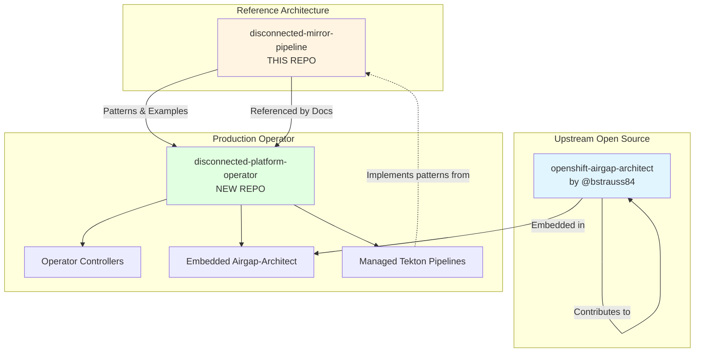
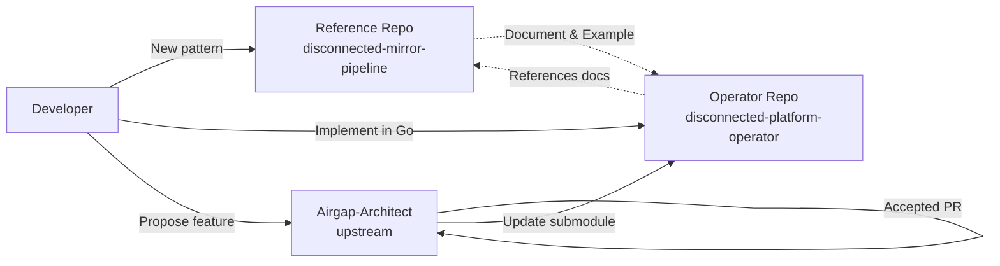

# Repository Strategy for Disconnected Platform

**Date:** 2026-05-08  
**Status:** Proposal  
**Purpose:** Define repository structure and separation of concerns

## TL;DR

**Three Repositories:**
1. **`openshift-airgap-architect`** (upstream) - Configuration wizard and interactive tools
2. **`disconnected-mirror-pipeline`** (this repo) - Reference architecture and Tekton pipeline examples
3. **`disconnected-platform-operator`** (new) - Production operator that orchestrates components

## Why Separate Repositories?

### Current Repository: `disconnected-mirror-pipeline`

**Purpose:** Reference architecture and educational resource

**What it is:**
- Example Tekton pipeline implementation
- Scripts and tools demonstrating the patterns
- Documentation for manual deployment
- Learning resource for teams building similar solutions

**What it is NOT:**
- A product ready for production deployment
- An installable operator
- A versioned, supported release

**Audience:**
- Platform engineering teams learning disconnected patterns
- Organizations building custom solutions
- Contributors understanding the architecture

**Lifecycle:**
- Updates as new patterns emerge
- Community-driven examples
- Documentation improvements
- No strict versioning required

---

### New Repository: `disconnected-platform-operator`

**Purpose:** Production-ready operator for disconnected OpenShift deployments

**What it is:**
- OLM-packaged operator
- Versioned releases with SBOM and signatures
- Production-grade automation
- Integrated UI with airgap-architect
- Support contract eligible

**What it includes:**
- Operator SDK-based controller
- CRDs for DisconnectedPlatform, ClusterBootstrap, etc.
- Embedded airgap-architect (as component)
- Tekton pipeline resources (managed)
- Console plugin for OpenShift web console
- Helm charts for deployment

**Audience:**
- End users deploying disconnected OpenShift
- Production operations teams
- Customers requiring support

**Lifecycle:**
- Semantic versioning (v1.0.0, v1.1.0, etc.)
- Release notes and changelogs
- Security updates and CVE patching
- Deprecation policies
- Migration guides between versions

---

### Upstream Repository: `openshift-airgap-architect`

**Purpose:** Configuration wizard and interactive deployment tool

**What we contribute:**
- Kubernetes API integration
- Mode detection (standalone/connected/airgapped)
- Pipeline trigger capabilities
- Import automation features
- Enhanced UI for operator integration

**Relationship:**
- Upstream project we enhance
- Fork if needed for operator-specific features
- Propose features via PRs to upstream
- Maintain compatibility with standalone mode

---

## Repository Relationships



## Detailed Separation of Concerns

### disconnected-mirror-pipeline (This Repo)

**Owns:**
- ✅ Reference Tekton pipeline YAML files
- ✅ Example scripts (checksum-tools, version-generator, etc.)
- ✅ Documentation of patterns and approaches
- ✅ Integration guides
- ✅ Architecture diagrams
- ✅ Example configurations (docs/examples/)

**Does NOT Own:**
- ❌ Operator implementation
- ❌ CRD definitions
- ❌ Controller logic
- ❌ OLM bundle
- ❌ Versioned releases for production

**Versioning:** 
- Git tags for documentation milestones
- No semantic versioning
- Branch per major phase (phase-1, phase-2, etc.)

**Release Process:**
- No formal releases
- Continuous updates to main branch
- Tagged examples for stability

---

### disconnected-platform-operator (New Repo)

**Owns:**
- ✅ Operator SDK scaffolding
- ✅ CRD definitions (DisconnectedPlatform, ClusterBootstrap, etc.)
- ✅ Controller implementation in Go
- ✅ OLM ClusterServiceVersion and bundle
- ✅ Embedded airgap-architect (as Git submodule or vendored)
- ✅ Managed Tekton pipeline resources
- ✅ Console plugin for OpenShift UI
- ✅ Helm charts for operator deployment
- ✅ E2E test suite
- ✅ CI/CD pipelines (build, test, release)
- ✅ SBOM generation
- ✅ Container signing
- ✅ Security scanning
- ✅ Documentation for operator usage

**Versioning:**
- Semantic versioning: v1.0.0, v1.1.0, v2.0.0
- OLM channel management (stable, fast, candidate)
- Release notes for each version
- CVE tracking and patching

**Release Process:**
- Automated CI/CD via GitHub Actions / Tekton
- Build multi-arch images (amd64, arm64, ppc64le, s390x)
- Sign with cosign
- Generate SBOM (CycloneDX/SPDX)
- Publish to OperatorHub.io
- Publish to Red Hat Ecosystem Catalog (if pursuing certification)
- Update disconnected artifact collections to include operator

---

## Directory Structures

### disconnected-mirror-pipeline (Current)

```
disconnected-mirror-pipeline/
├── README.md                           # Reference architecture overview
├── CLAUDE.md                           # Project instructions
├── docs/
│   ├── architecture.md                 # Pattern documentation
│   ├── examples/                       # Example configurations
│   ├── bootstrap-workflow.md           # Bootstrap guide
│   ├── future-vision-operator-integration.md  # Vision document
│   ├── repository-strategy.md          # This file
│   └── operator-specs/                 # Specs for operator repo
├── pipelines/
│   ├── connected/
│   │   ├── tasks/                      # Example Tekton tasks
│   │   └── base/                       # Example pipelines
│   └── disconnected/
├── scripts/
│   ├── common/                         # Reusable utilities
│   ├── connected/                      # Collection scripts
│   └── disconnected/                   # Import scripts
├── config/
│   ├── connected/                      # Example configs (gitignored)
│   └── common/
├── manifests/
│   ├── storage/                        # Example PVCs
│   ├── rbac/                           # Example RBAC
│   └── operators/                      # Example subscriptions
└── templates/                          # YAML templates
```

### disconnected-platform-operator (New)

```
disconnected-platform-operator/
├── README.md                           # Operator installation guide
├── PROJECT                             # Operator SDK metadata
├── Makefile                            # Build automation
├── Dockerfile                          # Multi-stage operator image
├── main.go                             # Operator entry point
├── go.mod / go.sum                     # Go dependencies
├── api/
│   └── v1alpha1/
│       ├── disconnectedplatform_types.go
│       ├── clusterbootstrap_types.go
│       └── zz_generated.deepcopy.go
├── controllers/
│   ├── disconnectedplatform_controller.go
│   ├── clusterbootstrap_controller.go
│   └── suite_test.go
├── config/
│   ├── crd/                            # CRD manifests
│   ├── rbac/                           # Operator RBAC
│   ├── manager/                        # Operator deployment
│   ├── samples/                        # CR examples
│   └── default/                        # Kustomize base
├── bundle/                             # OLM bundle
│   ├── manifests/
│   │   ├── disconnected-platform.clusterserviceversion.yaml
│   │   └── *.crd.yaml
│   ├── metadata/
│   │   └── annotations.yaml
│   └── tests/
├── web/                                # Embedded airgap-architect
│   ├── airgap-architect/               # Git submodule or vendored
│   └── console-plugin/                 # OpenShift console plugin
├── pkg/
│   ├── tekton/                         # Tekton resource management
│   ├── mirror/                         # oc-mirror integration
│   └── bootstrap/                      # Cluster bootstrap logic
├── hack/                               # Development scripts
│   ├── build-bundle.sh
│   ├── sign-images.sh
│   └── generate-sbom.sh
├── test/
│   ├── e2e/                            # End-to-end tests
│   └── integration/                    # Integration tests
├── docs/
│   ├── installation.md
│   ├── configuration.md
│   ├── operations.md
│   ├── troubleshooting.md
│   └── api-reference.md
├── .github/
│   └── workflows/
│       ├── build.yaml                  # CI build pipeline
│       ├── test.yaml                   # Test automation
│       ├── release.yaml                # Release automation
│       └── security-scan.yaml          # Trivy/Snyk scanning
└── charts/                             # Helm charts (alternative to OLM)
    └── disconnected-platform-operator/
```

---

## Development Workflow

### Phase 1-4: Current State (This Repo)
1. Build reference architecture in `disconnected-mirror-pipeline`
2. Document patterns and best practices
3. Create example implementations
4. Test and validate approaches

### Phase 5: Transition to Operator

#### Step 1: Create Operator Repository
```bash
# Initialize operator repository
operator-sdk init \
  --domain openshift.io \
  --repo github.com/yourorg/disconnected-platform-operator

# Create APIs
operator-sdk create api \
  --group disconnected \
  --version v1alpha1 \
  --kind DisconnectedPlatform \
  --resource --controller

operator-sdk create api \
  --group disconnected \
  --version v1alpha1 \
  --kind ClusterBootstrap \
  --resource --controller
```

#### Step 2: Migrate Components
- **Copy patterns** from this repo into operator controllers
- **Embed airgap-architect** as submodule or vendored code
- **Package Tekton resources** as managed operator resources
- **Adapt scripts** into Go packages

#### Step 3: Reference Documentation
- **Link from operator docs** back to this repo for patterns
- **Keep examples in sync** between repos
- **Document differences** between reference and production

---

## Cross-Repository Workflow

### When to Update Each Repo

**disconnected-mirror-pipeline:**
- New pipeline patterns discovered
- Better scripts or utilities developed
- Documentation improvements
- Example configuration updates
- Architecture refinements

**disconnected-platform-operator:**
- Operator features and enhancements
- Bug fixes in controller logic
- CRD schema updates
- Release management
- Security patches
- Performance improvements

**openshift-airgap-architect (Upstream):**
- Kubernetes API integration features
- Mode detection capabilities
- UI enhancements for operator
- Bug fixes applicable to standalone mode

### Synchronization Strategy



**Process:**
1. Prototype new patterns in reference repo
2. Document thoroughly with examples
3. Implement production version in operator repo
4. Operator references reference repo docs
5. Propose reusable features to airgap-architect upstream

---

## Migration Path

### Today: Reference Architecture
```
disconnected-mirror-pipeline (this repo)
└── Contains everything
```

### Phase 5A: Operator Created
```
disconnected-mirror-pipeline (reference)
├── Patterns and examples
└── Documentation

disconnected-platform-operator (new)
├── Basic operator structure
├── CRD definitions
└── References reference repo
```

### Phase 6: Operator Mature
```
disconnected-mirror-pipeline (reference)
├── Updated patterns
├── Advanced examples
└── Links to operator

disconnected-platform-operator (production)
├── Full operator implementation
├── OLM bundle
├── Embedded airgap-architect
├── Managed Tekton pipelines
└── References reference repo for patterns

openshift-airgap-architect (upstream)
└── Enhanced with operator features
```

---

## Benefits of Separation

### For Users
✅ **Clear path**: Reference examples → Production operator  
✅ **Choice**: Use reference as-is or adopt operator  
✅ **Learning**: Understand patterns before deploying  
✅ **Support**: Operator can be officially supported  

### For Developers
✅ **Clean separation**: Educational vs. production code  
✅ **Independent versioning**: Reference evolves freely  
✅ **Focused PRs**: Operator PRs focus on production concerns  
✅ **Testing**: Different test strategies per repo  

### For Maintainers
✅ **Release management**: Only operator needs formal releases  
✅ **Security**: Only operator requires CVE tracking  
✅ **Compatibility**: Operator maintains strict compatibility  
✅ **Documentation**: Reference docs don't need version management  

---

## Repository Ownership

### disconnected-mirror-pipeline
- **Owner:** Platform team / Community
- **License:** Apache 2.0
- **Governance:** Community-driven
- **Support:** Community support / Issues

### disconnected-platform-operator
- **Owner:** Product team / Organization
- **License:** Apache 2.0 (or commercial if desired)
- **Governance:** Product roadmap driven
- **Support:** Official support contracts available

### openshift-airgap-architect
- **Owner:** @bstrauss84 (upstream maintainer)
- **License:** Apache 2.0 (per upstream)
- **Governance:** Upstream maintainer + contributors
- **Support:** Community / Our contributions

---

## Communication Between Repos

### Issue Linking
```markdown
# In operator issue:
This implements the pattern documented in:
disconnected-mirror-pipeline#42

# In reference repo issue:
See production implementation:
disconnected-platform-operator#123
```

### Cross-References
- Operator README links to reference architecture
- Reference README links to operator for production use
- Shared changelog/roadmap document
- Quarterly sync meetings

---

## Decision: Separate Repositories

**Recommendation:** YES - Create separate `disconnected-platform-operator` repository

**Rationale:**
1. Different audiences (learners vs. users)
2. Different lifecycles (evolving vs. stable)
3. Different release requirements (examples vs. supported product)
4. Cleaner separation of concerns
5. Enables commercial support for operator while keeping reference open

**Timeline:**
- **Now (Phase 1-4):** Continue building reference architecture
- **Phase 5A:** Create operator repository
- **Phase 5B-6:** Migrate and build operator
- **Ongoing:** Maintain both repositories with clear purposes

---

## Next Steps

1. **Complete Phase 1-4** in current repository
2. **Create operator-specs/** directory here with detailed specs
3. **Document contribution guidelines** for airgap-architect
4. **Set up operator repository** when ready for Phase 5
5. **Establish sync cadence** between repos
6. **Create cross-linking documentation**

---

## Conclusion

The three-repository strategy provides:
- **Clear separation** between learning and production
- **Flexibility** for users to choose their path
- **Professional support** options for operator
- **Community collaboration** on reference architecture
- **Upstream contributions** to airgap-architect

This approach maximizes value for all audiences while maintaining clean architecture and governance.
